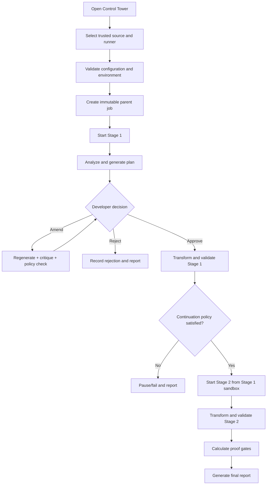
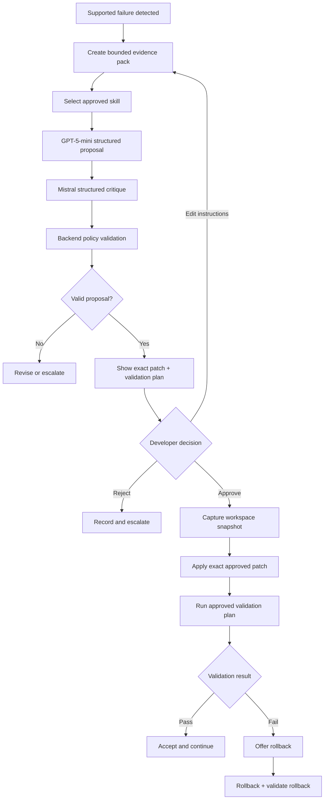
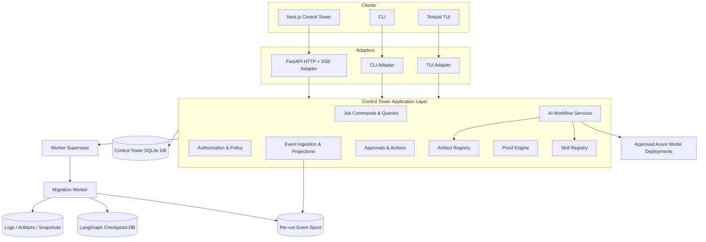
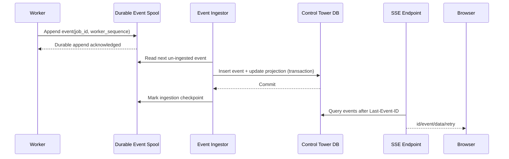
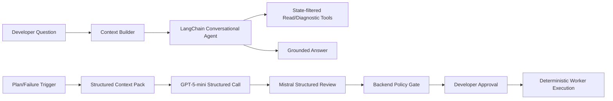
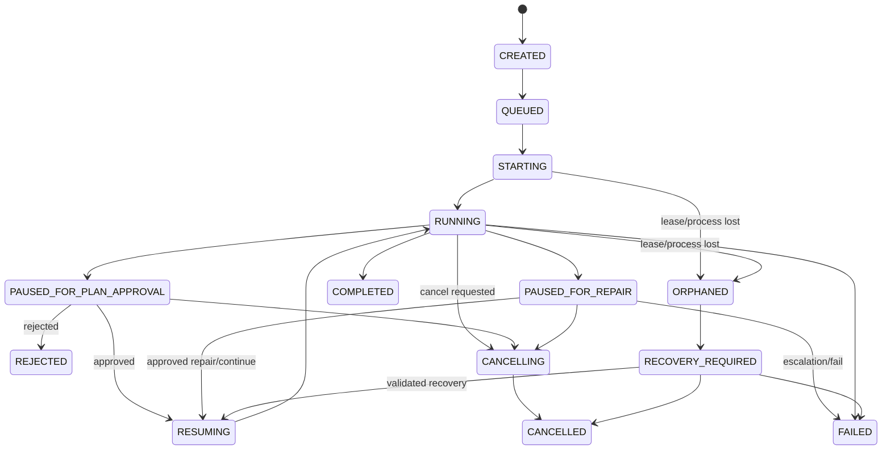
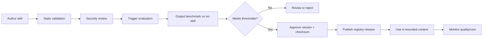

# PRD — AI Migration Control Tower

**Version:** 0.3 — DRAFT FOR ENGINEERING REVIEW  
**Status:** VALIDATED 
**Owner:** ABDELILAH MORTAKI  
**Last Updated:** 2026-06-08  
**Reviewers:** ABDELILAH MORTAKI · HAMDAOUI Ali · ilyas abarbach

---

## 0. Document Map

| Section | What it answers |
|---|---|
| 1. Executive Summary | What are we building and what is the recommended delivery approach? |
| 2. Context & Validated Baseline | What exists today and what has actually been proven? |
| 3. Problem Statement | Which operational and governance problems remain? |
| 4. Product Goals & Principles | What outcome and constraints guide the product? |
| 5. Users & Permissions | Who uses the system and what may they do? |
| 6. Scope & Release Slices | What belongs to the V1 program and in which delivery slice? |
| 7. Main User Flows | How does a developer use the product end to end? |
| 8. Functional Requirements | What must the system do? |
| 9. Target Architecture | How are responsibilities separated? |
| 10. State & Recovery Models | How do jobs, stages, commands, approvals, and repairs transition? |
| 11. Data & Contract Schemas | What are the core persisted and exchanged structures? |
| 12. API & Event Surface | How do clients and workers interact with the Control Tower? |
| 13. Non-Functional Requirements | How well, safely, and reliably must it operate? |
| 14. Security & Trust Model | What is trusted, untrusted, and explicitly prohibited? |
| 15. AI, Skills & Evaluation Governance | How are models, skills, context, and quality controlled? |
| 16. Risks, Assumptions & Dependencies | What could block delivery or invalidate the design? |
| 17. Open Questions | What remains unresolved and by when? |
| 18. Milestones & Build Sequence | In what order should engineering deliver the system? |
| 19. Acceptance Criteria | What must pass before each release slice is accepted? |
| 20. Appendix | Locked decisions, rejected designs, glossary, and references |

---

# 1. Executive Summary

## 1.1 Product definition

The **AI Migration Control Tower** is a local-first governance and operational platform for enterprise Java and Spring Boot migrations.

It is built around the existing AI Migration Factory and adds:

- persistent migration jobs, events, approvals, artifacts, and proof;
- a live developer dashboard;
- a governed two-stage migration workflow;
- plan review and amendment;
- a run-scoped Migration Assistant;
- developer-approved AI repair proposals;
- deterministic validation, rollback, and proof reporting;
- a shared application layer used by the web UI, CLI, and Textual TUI.

The Control Tower does **not** replace LangGraph, OpenRewrite, Maven, tests, or migration policies. It governs and exposes them.

## 1.2 Core architectural decision

> The product is backend-first and interface-independent. The migration engine, worker, persistence, and Control Tower application layer must operate without Next.js. Next.js is the primary visual client. CLI and Textual TUI remain fallback clients over the same application services and persisted state.

No migration business rule may exist exclusively in Next.js.

## 1.3 Recommended delivery approach

The V1 program is delivered through progressive release slices rather than one large all-or-nothing release:

```text
Foundation Vertical Slice
    Domain + DB + one worker command + API + minimal Next.js view

Execution Slice
    Worker supervision + two-stage migration + cancellation + report

Governance Slice
    Plan amendment + approval + durable pause/resume

Assistant Slice
    Context Builder + read-only Migration Assistant

Repair Slice
    Structured proposal + critique + approval + apply + validate + rollback

Knowledge Slice
    Approved skills + shared RAG + local evaluations
```

## 1.4 Engineering-readiness judgment

Development may begin with **M0 architecture validation** and the **foundation vertical slice**.

The team must not begin source-changing AI repair implementation until the following have been proven:

- Windows process-tree cancellation;
- LangGraph interrupt/re-entry behavior;
- worker-event durability and idempotent ingestion;
- per-command JDK selection;
- GPT-5-mini structured output through the selected Azure deployment;
- Mistral-Large-3 critique output and validation behavior;
- SQLite concurrency and recovery behavior.

---

# 2. Context & Validated Baseline

## 2.1 Product summary

| Attribute | Current definition |
|---|---|
| Product | AI Migration Control Tower |
| Product type | Internal developer tool |
| Primary user | Developer / Migration Engineer |
| Deployment | Local-first on a trusted Windows 10/11 workstation |
| Existing engine | LangGraph + OpenRewrite + Maven + policies + repair foundations |
| Existing interface | Terminal and Textual TUI |
| Primary future interface | Next.js dashboard with run-scoped assistant |
| Concurrency | Exactly one nonterminal migration job |
| Technical truth | OpenRewrite results, Maven, tests, dependency policy, and optional runtime gates |

## 2.2 Validated migration path

The currently validated real-application path requires two stages:

```text
Stage 1
Spring Boot 2.1.6 → Spring Boot 2.7
Java execution target: 11

Stage 2
Spring Boot 2.7 → Spring Boot 3.5.14
Java execution target: 17
```

## 2.3 Validated outcome

```text
Legacy source preserved
Migration performed in a sandbox workspace
Final Java target: 17
Final Spring Boot target: 3.5.14
Maven clean test: passed
Dependency risks: reported
Achieved proof: build_test_verified
```

Spring Boot 3.5.14 is a pinned, validated target profile. It is not dynamically interpreted as “latest Spring Boot.” Any future target version requires a new versioned pipeline profile and validation campaign.

## 2.4 Explicitly unproven outcomes

The current baseline does not prove:

```text
Runtime/H2 startup
Endpoint smoke tests
SQL Server integration
JWT configuration
Keystore configuration
common-utils runtime compatibility
Production deployment readiness
Production-readiness certification
```

## 2.5 Existing implementation reality

| Capability | Current status |
|---|---|
| LangGraph migration orchestration | Implemented |
| Analysis, planning, and assessment | Implemented |
| Human approval interrupt | Implemented, limited |
| OpenRewrite transformation | Implemented |
| Maven build/test validation | Implemented |
| Dependency-policy reporting | Implemented |
| LLM repair proposal foundation | Implemented |
| Deterministic fallback repair plan | Implemented |
| Patch gate / rollback foundations | Implemented |
| Textual TUI | Implemented |
| True live command streaming | Partial |
| Governed plan amendment loop | Not implemented |
| Control Tower application layer | Not implemented |
| Next.js dashboard | Not implemented |
| FastAPI adapter | Not implemented |
| Persistent operational event store | Not implemented |
| Worker supervisor and heartbeat | Not implemented |
| Durable worker-event spool | Not implemented |
| Run-scoped Migration Assistant | Not implemented |
| Bounded Context Builder | Not implemented |
| Approved skill registry | Not implemented |
| Developer-approved general AI repair | Not implemented |
| Parent two-stage migration job | Not implemented |

## 2.6 Product boundary

The Control Tower is a governance layer over the migration engine.

```text
Migration Engine
    Performs migration work

Control Tower Application Layer
    Owns operational state, commands, approvals, proof, and audit

Clients
    Display state and submit typed commands
```

---

# 3. Problem Statement

## 3.1 Core pains

| ID | Pain | Current evidence |
|---|---|---|
| PAIN-01 | No unified live migration visibility | Terminal/TUI workflow; subprocess output may appear only after completion |
| PAIN-02 | No complete plan governance | Approve/reject exists, but amendment, regeneration, critique, and revision history do not |
| PAIN-03 | No grounded conversational interface | Developers cannot ask run-specific questions or prepare governed actions during a live job |
| PAIN-04 | No durable operational history | Artifacts exist, but events, decisions, worker state, approvals, and chat are not unified |
| PAIN-05 | Proof is not centrally governed | Build/test evidence exists, but target proof and achieved proof are not consistently modeled |
| PAIN-06 | The validated two-stage path is operated as separate runs | No parent job or controlled Stage 1 → Stage 2 handoff exists |
| PAIN-07 | AI repair is not governed end to end | Proposal foundations exist, but review, exact approval, application, validation, and rollback are incomplete |
| PAIN-08 | Configuration is terminal-centric | Environment setup is recreated through PowerShell variables and commands |
| PAIN-09 | Crash and restart recovery are incomplete | No lease, heartbeat, durable event ingestion, orphan reconciliation, or recovery state |
| PAIN-10 | LLM context can be oversized or stale | No bounded, reproducible Context Builder exists |
| PAIN-11 | Interface and engine could diverge | The TUI and future web UI risk implementing separate behavior |
| PAIN-12 | Specialized migration expertise is not reusable | Prompt knowledge and known failure procedures are not versioned as approved skills |

## 3.2 Root cause

The migration engine was implemented before the operational product layer. The system is artifact-driven and terminal-driven instead of command-, event-, and state-driven.

## 3.3 Product opportunity

Create a developer-focused Control Tower where:

- deterministic migration mechanisms remain primary;
- operational state is durable and queryable;
- approvals are exact and auditable;
- AI assistance is bounded and grounded;
- source-changing actions require explicit developer authorization;
- technical proof is calculated only from deterministic evidence.

---

# 4. Product Goals & Principles

## 4.1 Primary goal

> A developer can configure, start, observe, govern, repair, validate, recover, and complete the supported two-stage Spring Boot migration through a shared Control Tower backend, with Next.js as the primary visual client and all actions, evidence, decisions, and proof recorded.

## 4.2 Product principles

1. **Backend first, clients replaceable.** Next.js, CLI, and TUI consume the same application services.
2. **Deterministic first.** OpenRewrite, Maven, tests, and policies remain primary.
3. **AI assists; humans authorize.** AI may diagnose, draft, and critique. It cannot approve source changes.
4. **Evidence over claims.** Proof is calculated from registered validation evidence.
5. **One operational source of truth.** The Control Tower database owns user-visible operational state.
6. **Durable workflow state is separate.** LangGraph checkpoints own internal continuation state, not dashboard truth.
7. **Local first.** V1 runs on a trusted developer-managed Windows workstation.
8. **One active migration.** Exactly one nonterminal job is supported in V1.
9. **Bounded context.** Models receive only task-relevant evidence and approved instructions.
10. **Trace everything.** Commands, model calls, skills, approvals, artifacts, validation, and proof are auditable.
11. **Fail closed for mutation.** Uncertain authorization, stale approval, or state conflict blocks source-changing work.
12. **Degrade gracefully without AI.** Deterministic execution and operational controls remain available when models are unavailable.

## 4.3 Success metrics

### Functional acceptance

| Metric | Target |
|---|---|
| Create and start a supported migration without manual terminal environment setup after runner registration | Required |
| Observe persisted stage and command progress in Next.js without refresh | Required |
| Use CLI/TUI over the same jobs and application rules | Required |
| Reconnect browser and replay missing events | Required |
| Complete plan amendment → regeneration → critique → policy validation → approval | Required |
| Complete the supported two-stage parent job | Required |
| Prevent a second nonterminal migration | Required |
| Produce a report for every terminal state | Required |
| Complete approved repair → validation → rollback/continue | Required for Repair Slice |
| False achieved-proof claims | 0 |
| Unauthorized or invalid mutation accepted | 0 |

### Operational targets

| Metric | Target |
|---|---|
| Persisted domain event to local browser latency | p95 < 1 second |
| Initial current-run projection load | < 2 seconds locally |
| Worker crash detection | Within configured lease-expiry window |
| Event replay after reconnect | No lost persisted events |
| Assistant first streamed response | < 5 seconds excluding provider queue incidents |
| Report generation for terminal jobs | 100% attempted; failure recorded without erasing evidence |

### User-outcome targets

| Metric | Target |
|---|---|
| Median time to correctly understand a supported build failure | < 3 minutes |
| Evidence-grounded operational assistant answers | ≥ 95% on benchmark suite |
| Correct insufficient-evidence escalation | ≥ 95% on unsupported benchmark cases |
| Approved patch checksum equals applied patch checksum | 100% |
| Skill-enabled quality improves over no-skill baseline | Required before skill approval |

## 4.4 Benchmark failure set

Initial supported benchmark cases:

```text
Tomcat 9 override under Spring Boot 3
Old Zalando dependency
Incomplete javax → jakarta migration
Missing caching.time-out property
Invalid test profile configuration
Wrong migration profile requiring two stages
Explicit BOM version conflict
Overly broad OpenRewrite diff
Insufficient evidence requiring escalation
```

---

# 5. Users & Permissions

## 5.1 Primary user — Developer / Migration Engineer

The developer:

- registers or selects a runner profile;
- selects a trusted source and output root;
- starts and monitors the migration;
- amends and approves plans;
- asks grounded questions;
- reviews repair proposals and validation plans;
- approves or rejects exact source changes;
- requests cancellation, resume, recovery, or rollback;
- reviews target versus achieved proof;
- downloads final evidence and reports.

## 5.2 V1 identity decision

V1 is a **single-operator, loopback-only application**.

```text
Network binding: 127.0.0.1 by default
Operator identity: authenticated operating-system user captured as actor metadata
Live viewer role: deferred
Company SSO: deferred
Remote multi-user access: out of scope
```

If binding changes from loopback, authentication becomes mandatory before release.

## 5.3 Future visibility users

Team Lead, Architect, and Project Manager visibility is supported through exported reports in V1. A live read-only role is deferred to a later release.

## 5.4 Permission model

| Action | Local developer | Assistant model |
|---|---:|---:|
| View registered run evidence | Yes | Through authorized tools only |
| Create migration | Yes | No |
| Approve plan | Yes | No |
| Draft amendment | Yes | Yes |
| Submit amendment | Yes | Only as a proposed action |
| Run safe inspection | Yes | Yes, when state-authorized |
| Run validation | Yes | Only when requested or approved |
| Apply source-changing patch | Yes, exact approval required | No direct access |
| Roll back | Yes, confirmation required | No direct access |
| Cancel job | Yes, confirmation required | No direct access |
| Change proof | No direct manual override | No |

---

# 6. Scope & Release Slices

## 6.1 V1 program scope

The V1 program includes the complete Control Tower vision, delivered through dependent slices.

### Slice A — Foundation Vertical Slice

```text
Domain model
Control Tower SQLite database
One controlled worker command
Durable worker-event spool
FastAPI job API
SSE replay
Minimal Next.js current-run page
Basic cancellation
```

### Slice B — Deterministic Execution

```text
Runner profiles
Per-command JDK selection
Worker supervisor, heartbeat, and lease
Two-stage parent job
Live Maven/OpenRewrite/test logs
Artifacts and history
Basic final report
CLI/TUI shared access
```

### Slice C — Governance

```text
Analysis and plan review
Plan amendment and regeneration
Reviewer critique
Policy validation
Exact developer approval
Durable pause and resume
```

### Slice D — Read-only Assistant

```text
Run-scoped conversation
Basic Context Builder
Safe inspection tools
Evidence citations
Status/failure/proof explanations
Assistant streaming
```

### Slice E — Governed Repair

```text
Failure classification
Structured repair proposal
Reviewer critique
Policy gate
Exact patch approval
Snapshot and application
Change-aware validation
Rollback and continuation
```

### Slice F — Knowledge & Quality

```text
Approved skill registry
Shared RAG
Previous approved case retrieval
Local evaluation runner
Optional LangSmith integration
Release thresholds and cost analysis
```

## 6.2 Explicitly out of scope

```text
Multiple concurrent nonterminal migrations
Remote/distributed worker agents
Cloud/SaaS deployment
Production deployment
Automatic Git push or artifact publication
Automatic AI source modification
Unrestricted shell, PowerShell, Python, or Maven tools
Public or repository-discovered skills
Executable skill scripts
Deep Agents as a V1 runtime dependency
Generic model fallback
Manager/client-specific dashboards
Real-time multi-user collaboration
Production-readiness certification
Untrusted public repository execution
Complete machine-security sandboxing
```

## 6.3 Trust boundary

The migration workspace protects the legacy source from intentional modification by the Control Tower, but it is not a complete machine-security sandbox.

Maven plugins, tests, OpenRewrite, and Java processes execute with the worker account’s operating-system permissions. V1 is therefore limited to trusted internal repositories.

## 6.4 Supported repository envelope

Initial acceptance envelope:

```text
Build system: Maven 3.9.x
Project types: single-module and validated multi-module Maven projects
Packaging: jar and validated war projects
Source: trusted internal repositories only
Target: supported versioned Spring Boot pipeline profiles
Maximum active jobs: 1
Network: only approved model, Maven repository, and documentation endpoints
```

Exact project-size and retention limits are configured and validated during M0/M1.

---

# 7. Main User Flows

## 7.1 Main deterministic migration flow



## 7.2 Repair flow



## 7.3 Browser reconnect flow

```text
Browser loads current job projection
→ browser opens SSE with Last-Event-ID
→ API replays persisted events after that sequence
→ browser applies events idempotently
→ live stream continues
```

## 7.4 Recovery flow

```text
API/worker restart
→ reconcile DB job state, lease, PID, event spool, and LangGraph checkpoint
→ consistent: resume permitted
→ inconsistent: RECOVERY_REQUIRED
→ developer chooses validated recovery, fail, or cancel
```


---

# 8. Functional Requirements

Priority definitions:

- **P0:** Required for the acceptance of the named release slice.
- **P1:** Required for a complete V1 program but may follow the first usable slice.
- **P2:** Desirable enhancement.

## 8.1 Configuration & Runner Profiles

| ID | Requirement | Priority | Slice |
|---|---|---:|---|
| F-CFG-01 | Developer selects legacy source through a backend-powered folder picker limited to allowlisted roots | P0 | B |
| F-CFG-02 | Developer selects output root, runner profile, and versioned pipeline profile | P0 | B |
| F-CFG-03 | Developer configures typed policy settings including LLM use, repair limits, runtime gates, endpoint gates, dependency fixes, and target proof | P0 | B |
| F-CFG-04 | Source and output paths must differ; output must not be inside source | P0 | A |
| F-CFG-05 | Path validation detects traversal, symlink, and Windows junction escapes | P0 | A |
| F-CFG-06 | The system writes an immutable, checksummed `run_configuration.json` before execution | P0 | A |
| F-CFG-07 | Secrets remain server-side and are excluded from frontend payloads and normal artifacts | P0 | A |
| F-CFG-08 | Runner health checks validate Python, Maven, JDK inventory, filesystem access, model endpoints, SQLite, and required native capabilities | P0 | B |
| F-CFG-09 | Unsupported or unhealthy runner/pipeline profiles block job creation with actionable errors | P0 | B |
| F-CFG-10 | Configuration records schema, pipeline, recipe, policy, graph, prompt, and skill-registry versions | P0 | B |
| F-CFG-11 | The frontend cannot provide arbitrary executable paths, model deployment IDs, Maven goals, or environment variables | P0 | A |
| F-CFG-12 | Model credentials and Maven repository credentials are referenced by secure server-side identifiers | P0 | B |

## 8.2 Job Lifecycle & Concurrency

| ID | Requirement | Priority | Slice |
|---|---|---:|---|
| F-JOB-01 | Exactly one nonterminal migration job may exist | P0 | A |
| F-JOB-02 | The application layer and database enforce the single-job rule transactionally | P0 | A |
| F-JOB-03 | A second job request returns a conflict containing the active job reference | P0 | A |
| F-JOB-04 | Paused, orphaned, and recovery-required jobs remain nonterminal | P0 | A |
| F-JOB-05 | Job creation supports an idempotency key | P0 | A |
| F-JOB-06 | Worker PID, start time, heartbeat, lease expiry, exit code, and process-group reference are persisted | P0 | B |
| F-JOB-07 | Stale lease or missing process moves the job to `ORPHANED` or `RECOVERY_REQUIRED` according to reconciliation evidence | P0 | B |
| F-JOB-08 | Application startup reconciles nonterminal jobs, worker process, event spool, and LangGraph checkpoint | P0 | B |
| F-JOB-09 | Developer can request cancellation through a typed command | P0 | A |
| F-JOB-10 | Cancellation is idempotent and terminates the complete controlled process tree | P0 | B |
| F-JOB-11 | Terminal jobs remain queryable without restarting the worker | P0 | B |
| F-JOB-12 | State-changing commands use expected job version / optimistic concurrency checks | P0 | B |
| F-JOB-13 | Stale or duplicate state-changing commands are rejected and audited | P0 | B |

## 8.3 Worker Supervision & Command Execution

| ID | Requirement | Priority | Slice |
|---|---|---:|---|
| F-WRK-01 | Full migrations never execute inside HTTP request handlers | P0 | A |
| F-WRK-02 | The supervisor launches a separate Python worker process using immutable run configuration | P0 | B |
| F-WRK-03 | Each Maven/Java/OpenRewrite command uses a controlled environment and explicit working directory | P0 | A |
| F-WRK-04 | Standard output and error are drained concurrently and written to append-only logs | P0 | A |
| F-WRK-05 | Every command has a stable command ID, timeout, retry policy, process reference, and evidence artifacts | P0 | A |
| F-WRK-06 | Each Java/Maven command selects an approved JDK from the runner inventory | P0 | B |
| F-WRK-07 | Windows commands are attached to a controlled Windows Job Object or an M0-approved equivalent | P0 | B |
| F-WRK-08 | Cancellation first requests graceful termination, then force-terminates the controlled process tree after timeout | P0 | B |
| F-WRK-09 | Repository-local Maven Wrapper is disabled by default unless separately trusted and validated | P1 | B |
| F-WRK-10 | The worker never inherits the complete API-process environment blindly | P0 | A |
| F-WRK-11 | Command results include exit code, duration, timeout, cancellation, selected JDK, and artifact references | P0 | A |
| F-WRK-12 | Non-idempotent commands are never automatically retried | P0 | B |

## 8.4 Durable Worker Events

| ID | Requirement | Priority | Slice |
|---|---|---:|---|
| F-EVT-01 | The worker appends typed events to a per-run durable event spool before they are considered emitted | P0 | A |
| F-EVT-02 | Every worker event contains `job_id`, `worker_sequence`, `event_type`, timestamp, payload schema version, and correlation metadata | P0 | A |
| F-EVT-03 | `(job_id, worker_sequence)` is unique and supports idempotent ingestion | P0 | A |
| F-EVT-04 | The Control Tower ingests the event and updates job projections in one database transaction | P0 | A |
| F-EVT-05 | Only persisted Control Tower domain events are streamed to clients | P0 | A |
| F-EVT-06 | Raw LangGraph stream IDs are never exposed as the public replay cursor | P0 | A |
| F-EVT-07 | Event gaps or conflicting sequence data move the job to `RECOVERY_REQUIRED` | P0 | B |
| F-EVT-08 | Event-spool compaction or cleanup occurs only after terminal state and verified ingestion | P1 | B |

## 8.5 Parent Two-Stage Migration

| ID | Requirement | Priority | Slice |
|---|---|---:|---|
| F-PIP-01 | The supported migration is represented as one parent job with ordered child stage runs | P0 | B |
| F-PIP-02 | Stage 1 uses the configured Java 11 execution profile | P0 | B |
| F-PIP-03 | Stage 2 uses the configured Java 17 execution profile | P0 | B |
| F-PIP-04 | Stage 2 source is the immutable validated Stage 1 sandbox output | P0 | B |
| F-PIP-05 | Stage 2 cannot start unless Stage 1 satisfies the continuation policy | P0 | B |
| F-PIP-06 | Default continuation requires transformation completion, successful compile/tests, completed dependency-policy gate, and no blocking policy finding | P0 | B |
| F-PIP-07 | Every stage records its pipeline profile, source snapshot checksum, workspace, JDK selection, and proof gates | P0 | B |
| F-PIP-08 | Parent status is derived from child stage, command, approval, and repair records | P0 | B |
| F-PIP-09 | Pipeline profiles are versioned and immutable once referenced by a job | P0 | B |

## 8.6 Live Dashboard & Clients

| ID | Requirement | Priority | Slice |
|---|---|---:|---|
| F-VIS-01 | Next.js displays parent job, current stage, graph node, command, elapsed time, and proof summary | P0 | A |
| F-VIS-02 | A minimal Next.js vertical slice is delivered before the complete backend to validate API and event contracts | P0 | A |
| F-VIS-03 | Server Components load initial job/report projections; Client Components handle SSE, chat, controls, and interactive viewers | P0 | A |
| F-VIS-04 | Browser refresh and reconnect recover persisted state and missing events | P0 | A |
| F-VIS-05 | Logs are incrementally loaded and filterable by stage, command, stream, severity, and time | P1 | B |
| F-VIS-06 | Plan, diff, repair, artifact, and proof panels display registered backend data only | P0 | C/E |
| F-VIS-07 | Disabled gates display `SKIPPED_BY_POLICY`, never `PASSED` | P0 | B |
| F-VIS-08 | Report generation and report access remain visible for failed, rejected, cancelled, and warning terminal states | P0 | B |
| F-VIS-09 | CLI and TUI consume the same application services and state-transition rules as FastAPI | P0 | B |
| F-VIS-10 | The TUI does not retain an independent migration execution path | P0 | B |
| F-VIS-11 | The web application contains no exclusive migration, authorization, proof, or approval logic | P0 | A |

## 8.7 Plan Review & Amendment

| ID | Requirement | Priority | Slice |
|---|---|---:|---|
| F-PLN-01 | The workflow pauses after analysis and initial plan generation | P0 | C |
| F-PLN-02 | The UI displays analysis, target profile, migration units, risks, constraints, allowed actions, forbidden actions, and validation plan | P0 | C |
| F-PLN-03 | Developer may approve, reject, or submit amendment instructions | P0 | C |
| F-PLN-04 | Amendment instructions are immutable artifacts with actor and timestamp | P0 | C |
| F-PLN-05 | Amendment regenerates a new plan revision; it does not directly mutate transformation commands | P0 | C |
| F-PLN-06 | GPT-5-mini produces the structured revised plan | P0 | C |
| F-PLN-07 | Mistral-Large-3 produces an advisory structured critique with no tools or approval authority | P0 | C |
| F-PLN-08 | Backend policy validates the plan schema, path scope, operations, constraints, and validation coverage | P0 | C |
| F-PLN-09 | Developer approves an exact plan revision checksum before transformation | P0 | C |
| F-PLN-10 | Stale, superseded, or expired plan approvals are rejected | P0 | C |
| F-PLN-11 | Every plan revision, amendment, critique, policy result, and decision remains queryable | P0 | C |
| F-PLN-12 | Reviewer/model unavailability pauses the AI-required step or escalates according to policy; it does not create an unreviewed source-changing plan | P0 | C |

## 8.8 LangGraph Orchestration

| ID | Requirement | Priority | Slice |
|---|---|---:|---|
| F-ORC-01 | The migration remains an explicit LangGraph workflow with predetermined stage transitions | P0 | B |
| F-ORC-02 | Every node containing an interrupt is safe to re-enter | P0 | C |
| F-ORC-03 | Non-idempotent side effects execute in separate nodes or checkpointed tasks | P0 | B |
| F-ORC-04 | Every external write uses an idempotency key or exact operation identity | P0 | B |
| F-ORC-05 | Every job records `graph_version` and `graph_state_schema_version` | P0 | B |
| F-ORC-06 | Paused jobs cannot resume under an incompatible graph/schema version without an explicit migration path | P0 | B |
| F-ORC-07 | LangGraph checkpoint state is never used directly as the public job projection | P0 | B |
| F-ORC-08 | Checkpoint/operational-state mismatch moves the job to `RECOVERY_REQUIRED` | P0 | B |

## 8.9 Migration Assistant

| ID | Requirement | Priority | Slice |
|---|---|---:|---|
| F-AST-01 | One run-scoped Migration Assistant appears beside the live pipeline | P0 | D |
| F-AST-02 | Each parent job has one assistant thread | P0 | D |
| F-AST-03 | The assistant reads only registered run evidence and approved shared knowledge | P0 | D |
| F-AST-04 | The assistant explains status, blockers, plans, diffs, failures, and proof with evidence references | P0 | D |
| F-AST-05 | Flexible conversational work may use LangChain `create_agent` | P0 | D |
| F-AST-06 | Agent-loop usage is limited to explanation, evidence navigation, and safe inspection/diagnostic selection | P0 | D |
| F-AST-07 | Plan generation, repair generation, reviewer critique, proof calculation, patch application, and rollback do not use an open-ended agent loop | P0 | C/E |
| F-AST-08 | Assistant tool availability is filtered deterministically by job state, permissions, policy, and operation class | P0 | D |
| F-AST-09 | The assistant has no generic shell, PowerShell, Python, arbitrary Maven, or unrestricted filesystem tool | P0 | D |
| F-AST-10 | All model calls, context packs, activated skills, tool proposals, tool results, and assistant actions are audited | P0 | D |
| F-AST-11 | Assistant may return `INSUFFICIENT_EVIDENCE` and request escalation | P0 | D |
| F-AST-12 | Chat streaming is separate from migration event SSE | P1 | D |
| F-AST-13 | Agent memory and conversation history are not authoritative migration state | P0 | D |
| F-AST-14 | The deterministic product remains usable when the assistant is unavailable | P0 | D |

## 8.10 Context Builder & Retrieval

| ID | Requirement | Priority | Slice |
|---|---|---:|---|
| F-CTX-01 | Every model call receives a bounded task-specific context pack | P0 | D |
| F-CTX-02 | The context pack includes security policy, task contract, run snapshot, activated skills, selected evidence, allowed tools, recent conversation, and output schema | P0 | D |
| F-CTX-03 | Entire repositories, full logs, all previous runs, and complete chat history are excluded by default | P0 | D |
| F-CTX-04 | Large logs are retrieved by relevant registered windows | P0 | D |
| F-CTX-05 | Source is retrieved at class, method, POM section, or configuration-block boundaries where practical | P1 | F |
| F-CTX-06 | Every context pack has an immutable manifest and checksum | P0 | D |
| F-CTX-07 | Repository content is treated as untrusted evidence, never system instruction | P0 | D |
| F-CTX-08 | Deterministic retrieval is implemented before vector retrieval | P0 | D |
| F-CTX-09 | Shared RAG sources are approved, versioned, and origin-labeled | P0 | F |
| F-CTX-10 | Retrieval records query, filters, selected chunks, scores where applicable, and source IDs | P1 | F |
| F-CTX-11 | Outbound model context passes secret/content policy scanning before provider submission | P0 | D |

## 8.11 Typed Tools

| ID | Requirement | Priority | Slice |
|---|---|---:|---|
| F-TOL-01 | Tools are named typed operations, not arbitrary commands | P0 | D |
| F-TOL-02 | Backend owns executable, working directory, arguments, flags, environment, timeout, and retry policy | P0 | B |
| F-TOL-03 | Inspection tools may be selected by the conversational agent after deterministic filtering | P0 | D |
| F-TOL-04 | Validation tools require a developer request, approved plan, or approved validation plan | P0 | D/E |
| F-TOL-05 | Source-changing execution tools are never directly available to the LLM | P0 | E |
| F-TOL-06 | State-changing proposals create pending Control Tower actions rather than performing mutation | P0 | E |
| F-TOL-07 | Every tool execution records validated arguments, result, evidence, duration, and authorization decision | P0 | D |
| F-TOL-08 | Automatic retry is limited to safe reads, searches, and idempotent diagnostics | P0 | D |

### Initial tool catalog

```text
Inspection
    get_run_status
    get_current_stage
    get_pending_approval
    search_run_artifacts
    read_log_window
    read_sandbox_file
    show_file_diff
    list_changed_files
    inspect_dependency_tree
    inspect_effective_pom

Knowledge
    search_shared_migration_knowledge
    find_similar_failure

Validation
    run_openrewrite_preview
    run_compile
    run_targeted_test
    run_full_unit_tests
    run_dependency_policy
    run_runtime_smoke
    run_endpoint_smoke

Proposal only
    draft_plan_amendment
    draft_repair
    prepare_cancellation
    prepare_rollback

Developer-confirmed backend commands
    submit_plan_amendment
    approve_plan_revision
    apply_approved_patch
    execute_approved_rollback
    cancel_job
    resume_job
```

## 8.12 Models & Structured AI Workflows

| ID | Requirement | Priority | Slice |
|---|---|---:|---|
| F-LLM-01 | GPT-5-mini is the primary worker model | P0 | C/D/E |
| F-LLM-02 | Mistral-Large-3 is the primary reviewer model | P0 | C/E |
| F-LLM-03 | Llama-3.3-70B-Instruct remains configured but disabled | P1 | F |
| F-LLM-04 | DeepSeek, Qwen, and gpt-oss-20b are excluded unless a later team decision changes policy | P0 | All |
| F-LLM-05 | Plan and repair generation use explicit structured workflows, not free agent loops | P0 | C/E |
| F-LLM-06 | Reviewer receives original evidence, constraints, proposal, and exact diff | P0 | C/E |
| F-LLM-07 | Reviewer has no tools and no execution or approval authority | P0 | C/E |
| F-LLM-08 | Provider adapter selects native JSON Schema, tool-based structured output, or prompted JSON fallback according to validated capability | P0 | C |
| F-LLM-09 | Every output passes schema validation and semantic policy validation | P0 | C/D/E |
| F-LLM-10 | Generic automatic model fallback is disabled in V1 | P0 | C/D/E |
| F-LLM-11 | A fallback may be used only if enabled in the backend registry and recorded explicitly | P1 | F |
| F-LLM-12 | Model deployment IDs are backend-controlled | P0 | C/D/E |
| F-LLM-13 | Usage, latency, tokens, estimated cost, prompt/schema/skill versions, and status are recorded | P1 | D/E/F |

## 8.13 Approved Skills

| ID | Requirement | Priority | Slice |
|---|---|---:|---|
| F-SKL-01 | The system maintains a versioned registry of approved migration skills | P0 | F |
| F-SKL-02 | Skill authoring uses the Agent Skills `SKILL.md` format where practical | P0 | F |
| F-SKL-03 | Only approved skill IDs, versions, and checksums may be activated | P0 | F |
| F-SKL-04 | Skill eligibility is filtered by task type, job state, failure class, and model role | P0 | F |
| F-SKL-05 | Skills are injected programmatically through custom Context Builder/LangChain middleware | P0 | F |
| F-SKL-06 | V1 does not depend on the full Deep Agents runtime | P0 | F |
| F-SKL-07 | V1 skills are instruction-only; executable skill scripts are prohibited | P0 | F |
| F-SKL-08 | Repository-provided `SKILL.md`, `AGENTS.md`, or prompt-like files are untrusted evidence | P0 | F |
| F-SKL-09 | Skills cannot grant tools, bypass policy, change authorization, or modify proof | P0 | F |
| F-SKL-10 | The experimental `allowed-tools` skill field is never authoritative | P0 | F |
| F-SKL-11 | Every model call records activated skill IDs, versions, and checksums | P0 | F |
| F-SKL-12 | Maximum active skills per call is configurable; initial default is one primary and one supporting skill | P1 | F |
| F-SKL-13 | Every skill has trigger tests, negative trigger tests, and output-quality evaluations | P0 | F |
| F-SKL-14 | A skill cannot be approved unless it improves the benchmark over the no-skill baseline without increasing unauthorized-action risk | P0 | F |

### Initial skill catalog

```text
migration-plan-governance
build-test-failure-diagnosis
dependency-bom-analysis
spring-source-migration-repair
runtime-configuration-diagnosis
proof-and-report-explanation
```

## 8.14 Repair Workflow

| ID | Requirement | Priority | Slice |
|---|---|---:|---|
| F-RPR-01 | Supported failures create a repair attempt and pause the job | P0 | E |
| F-RPR-02 | Failure classification occurs before skill and evidence selection | P0 | E |
| F-RPR-03 | Context Builder produces an immutable failure context pack | P0 | E |
| F-RPR-04 | GPT-5-mini produces a structured diagnosis, patch proposal, and validation plan | P0 | E |
| F-RPR-05 | Mistral-Large-3 critiques the proposal against original evidence and constraints | P0 | E |
| F-RPR-06 | Backend validates path scope, file types, operations, patch format, constraints, and validation coverage | P0 | E |
| F-RPR-07 | Developer sees root cause, evidence, exact proposed diff, critique, risks, and validation plan | P0 | E |
| F-RPR-08 | Editing instructions creates a new proposal; it does not silently modify the approved patch | P0 | E |
| F-RPR-09 | Approval is bound to job version, workspace snapshot, patch checksum, validation-plan checksum, policy version, actor, and expiry | P0 | E |
| F-RPR-10 | Approval is single-use and invalidated by any subject change | P0 | E |
| F-RPR-11 | No file is modified before exact developer confirmation | P0 | E |
| F-RPR-12 | Approved patches apply only to the sandbox | P0 | E |
| F-RPR-13 | A rollback-capable workspace snapshot is captured before application | P0 | E |
| F-RPR-14 | Applied patch checksum must equal approved patch checksum | P0 | E |
| F-RPR-15 | Failed validation offers another proposal, rollback, or human escalation | P0 | E |
| F-RPR-16 | Rollback result is validated and recorded | P0 | E |
| F-RPR-17 | Maximum attempts, model calls, and token budget are configurable | P1 | E |
| F-RPR-18 | The system supports `INSUFFICIENT_EVIDENCE` without generating a patch | P0 | E |

## 8.15 Change-Aware Validation

| ID | Requirement | Priority | Slice |
|---|---|---:|---|
| F-VAL-01 | Validation is selected from changed files, affected modules, repair type, and risk | P0 | E |
| F-VAL-02 | Validation plan is shown before source-changing approval | P0 | E |
| F-VAL-03 | Approved validation plan is immutable and checksummed | P0 | E |
| F-VAL-04 | Additional validation may be added after failure but approved checks cannot be silently removed | P0 | E |
| F-VAL-05 | Validation execution order and evidence are deterministic | P0 | E |
| F-VAL-06 | Proof updates only through deterministic gate rules | P0 | B/E |

### Initial validation mapping

| Change type | Minimum validation |
|---|---|
| `pom.xml` or dependency change | Compile + full unit tests + dependency policy |
| Java production source | Compile + targeted tests where available + full unit tests |
| Test-only source | Targeted test + full unit tests |
| Application configuration | Build/tests + applicable runtime gate |
| OpenRewrite write execution | Diff-risk review + build + tests + dependency policy |
| Runtime-only smoke configuration | Prior build/test evidence + runtime smoke |
| Multi-module parent configuration | Affected modules + dependent-module build/test according to pipeline policy |

## 8.16 Proof & Reporting

| ID | Requirement | Priority | Slice |
|---|---|---:|---|
| F-PRF-01 | Developer selects a target proof level supported by the pipeline | P0 | B |
| F-PRF-02 | Individual proof gates are authoritative | P0 | B |
| F-PRF-03 | A human-readable achieved proof summary is derived from gates | P0 | B |
| F-PRF-04 | Target and achieved proof are stored separately | P0 | B |
| F-PRF-05 | Disabled, blocked, or unexecuted gates cannot count as passed | P0 | B |
| F-PRF-06 | Every proof gate references evidence, policy version, command IDs, and timestamps | P0 | B |
| F-PRF-07 | Final report lists passed, warned, failed, skipped, blocked, and missing gates | P0 | B |
| F-PRF-08 | Report includes plan history, approvals, transformations, repairs, dependency findings, and artifacts | P0 | B/E |
| F-PRF-09 | `final/report_context.json` is generated for every terminal job | P0 | B |
| F-PRF-10 | Reports are downloadable as Markdown and JSON | P0 | B |
| F-PRF-11 | Report generation failure creates an auditable error without erasing previous evidence | P0 | B |
| F-PRF-12 | `production_ready` is not selectable or achievable in V1 | P0 | B |
| F-PRF-13 | Assistant cannot override or invent proof | P0 | D |

### V1 proof summaries

```text
analyzed
planned
transformed
build_test_verified
runtime_verified
endpoint_verified
```

## 8.17 History, Audit & Observability

| ID | Requirement | Priority | Slice |
|---|---|---:|---|
| F-AUD-01 | Every state transition records actor, prior state, new state, reason, version, and timestamp | P0 | A |
| F-AUD-02 | Every approval records exact subject type, subject ID/version/checksum, actor, decision, and expiry | P0 | C/E |
| F-AUD-03 | Every model call records provider, deployment, role, context pack, schema, skill versions, tokens, latency, and status | P1 | D/E/F |
| F-AUD-04 | Every tool/command execution records requested operation, authorized arguments, evidence, and result | P0 | B/D |
| F-AUD-05 | Audit records are append-only through normal application APIs | P0 | A |
| F-AUD-06 | Every request, command, event, and model call supports correlation and causation IDs | P0 | A |
| F-AUD-07 | Completed runs remain viewable without an active worker | P0 | B |
| F-AUD-08 | Local audit is documented as operationally append-only, not tamper-proof against a machine administrator | P0 | A |


---

# 9. Target Architecture

## 9.1 Component architecture



## 9.2 Responsibility boundaries

### Control Tower application layer

Owns:

```text
Business commands and queries
Job/stage/command projections
Single-job concurrency rule
Approval validity
Artifact registration
Event ingestion
Proof calculation
Authorization and policy
Skill registry
Audit records
Recovery decisions
```

### FastAPI adapter

Owns:

```text
HTTP request/response mapping
SSE transport
Input schema validation
Loopback access policy
Error translation
No migration execution
No exclusive business logic
```

### Worker supervisor

Owns:

```text
Worker launch
PID and lease tracking
Heartbeat observation
Process-tree cancellation
Exit-code collection
Startup reconciliation input
```

### Migration worker

Owns:

```text
Loading immutable run configuration
LangGraph execution
OpenRewrite execution
Maven/test execution
Creating logs and artifacts
Appending durable worker events
Writing LangGraph checkpoints
Never modifying legacy source
```

### Next.js

Owns:

```text
Rendering
Transient interaction state
SSE subscription
Chat token display
Typed command submission
No proof calculation
No authorization decisions
No direct filesystem/process/model access
```

## 9.3 Domain-event ingestion



## 9.4 Application module boundaries

```text
control_tower/domain
    entities, value objects, state enums, transition rules

control_tower/application
    commands, queries, services, policy orchestration

control_tower/infrastructure
    SQLite repositories, filesystem artifacts, process control, model adapters

control_tower/adapters/http
    FastAPI routes and SSE

control_tower/adapters/cli
    CLI commands

control_tower/adapters/tui
    Textual client

migration_engine
    LangGraph, OpenRewrite, Maven, policies

web
    Next.js application
```

## 9.5 AI architecture



## 9.6 LangChain, LangGraph, and skills boundary

| Technology | Approved use |
|---|---|
| LangGraph | Durable predetermined migration workflow, checkpoints, interrupts, repair/plan subgraphs |
| LangChain `create_agent` | Conversational explanation and safe inspection tool selection |
| LangChain structured output | Typed AI responses with provider-aware strategy and backend validation |
| LangChain middleware | Custom context injection, limits, safe retry, summarization, logging |
| Agent Skills format | Portable approved instruction packages loaded through custom middleware |
| Deep Agents | Not a V1 runtime dependency |
| LangSmith | Optional tracing/evaluation integration; disabled by default |

## 9.7 JDK execution architecture

The Python worker has no “worker JDK.” Each controlled Java/Maven operation selects a JDK explicitly.

```text
Command Plan
    operation = MAVEN_TEST
    selected_jdk = java_11
    java_home = resolved approved path
    maven = approved Maven 3.9.x path
    working_directory = stage workspace
    timeout = policy value
```

Maven Toolchains may be used when validated for the project and involved plugins. The command executor still records the JDK used to run Maven and any selected toolchain.

## 9.8 Windows process architecture

```text
Supervisor creates controlled Windows Job Object
→ worker command process is assigned
→ Maven/Surefire/Java descendants remain controlled
→ graceful cancellation is requested
→ force terminate Job Object after timeout
→ command and child exit evidence is recorded
```

M0 must confirm behavior when the Control Tower itself is already running inside a parent Windows Job Object.

## 9.9 Persistence architecture

```text
Control Tower DB
    Operational truth and projections

LangGraph checkpoint DB
    Internal workflow continuation

Event spool
    Durable worker-to-Control-Tower delivery

Artifact filesystem
    Logs, plans, diffs, patches, snapshots, reports
```

The Control Tower database and LangGraph checkpoint database may use SQLite in V1, but they remain logically separate. Backup and recovery procedures must include active WAL/SHM files where applicable.

---

# 10. State & Recovery Models

## 10.1 Job states

```text
CREATED
QUEUED
STARTING
RUNNING
PAUSED_FOR_PLAN_APPROVAL
PAUSED_FOR_REPAIR
RESUMING
CANCELLING
ORPHANED
RECOVERY_REQUIRED
COMPLETED
FAILED
REJECTED
CANCELLED
```

### Job transitions



## 10.2 Stage states

```text
PENDING
READY
RUNNING
PAUSED
PASSED
PASSED_WITH_WARNINGS
FAILED
SKIPPED_BY_POLICY
BLOCKED
CANCELLED
```

## 10.3 Command states

```text
QUEUED
STARTING
RUNNING
SUCCEEDED
FAILED
TIMED_OUT
CANCELLING
CANCELLED
LOST
```

## 10.4 Approval states

```text
DRAFT
PENDING
APPROVED
REJECTED
EXPIRED
SUPERSEDED
CONSUMED
INVALIDATED
```

Approval rules:

- one exact subject per approval;
- approval is single-use;
- approval expires;
- approval is invalidated if job version, patch, plan, validation plan, policy, or workspace snapshot changes;
- approval cannot be issued by a model;
- approval cannot be reused after failed execution.

## 10.5 Repair states

```text
DETECTED
CLASSIFIED
CONTEXT_READY
PROPOSAL_GENERATING
PROPOSAL_READY
CRITIQUE_READY
POLICY_BLOCKED
AWAITING_DEVELOPER
APPROVED
APPLYING
VALIDATING
ACCEPTED
VALIDATION_FAILED
ROLLING_BACK
ROLLED_BACK
ROLLBACK_FAILED
REJECTED
ESCALATED
```

## 10.6 Proof-gate states

```text
NOT_REQUESTED
PENDING
RUNNING
PASSED
WARNED
FAILED
SKIPPED_BY_POLICY
BLOCKED
NOT_EXECUTED
```

## 10.7 Recovery reconciliation matrix

| DB state | Worker/process evidence | Checkpoint evidence | Event spool | Result |
|---|---|---|---|---|
| Running | Alive + heartbeat current | Compatible | No gap | Continue |
| Running | Missing | Compatible | Complete | `ORPHANED` → validate recovery |
| Running | Missing | Missing/incompatible | Any | `RECOVERY_REQUIRED` |
| Paused | No worker expected | Compatible interrupt | Complete | Remain paused |
| Paused | Worker alive unexpectedly | Compatible | Any | `RECOVERY_REQUIRED` |
| Terminal | Worker alive | Any | Any | Terminate worker and audit |
| Any | Event sequence gap/conflict | Any | Gap | `RECOVERY_REQUIRED` |

## 10.8 Derived parent status rule

The parent job status is calculated by the application layer from:

```text
stage states
active command state
pending approvals
repair state
cancellation request
worker lease
recovery flags
```

No adapter or model may set the parent status directly.

---

# 11. Data & Contract Schemas

The following schemas are product contracts. Exact database types may vary, but semantic fields and invariants are required.

## 11.1 Runner profile — YAML

```yaml
schema_version: "1.0"
id: local-windows-java-multi
name: Windows Local — Maven 3.9 / JDK 11, 17, 21
python_executable: "C:/.../python.exe"
maven:
  executable: "C:/.../mvn.cmd"
  expected_version: "3.9.x"
  settings_ref: "maven-settings-default"
  allow_wrapper: false
jdks:
  java_11:
    home: "C:/Program Files/Java/jdk-11"
    version_constraint: "11"
  java_17:
    home: "C:/Program Files/Java/jdk-17"
    version_constraint: "17"
  java_21:
    home: "C:/Program Files/Java/jdk-21"
    version_constraint: "21"
ai:
  registry_profile_id: "azure-migration-models"
filesystem:
  allowed_source_roots:
    - "C:/Migration/Sources"
  allowed_output_roots:
    - "C:/Migration/Runs"
network:
  policy_id: "local-v1-egress"
```

## 11.2 Pipeline definition — YAML

```yaml
schema_version: "1.0"
pipeline_id: springboot-216-to-35-java17
pipeline_version: "1.0.0"
display_name: Spring Boot 2.1.6 to 3.5.14 / Java 17
stages:
  - index: 1
    profile_id: springboot-216-to-27
    source_constraint: "spring-boot:2.1.6"
    target:
      spring_boot: "2.7.x"
      java: 11
    command_jdk: java_11
    continuation_policy_id: stage1-build-test-policy
  - index: 2
    profile_id: springboot-27-to-3514
    source_from_previous_stage: true
    target:
      spring_boot: "3.5.14"
      java: 17
    command_jdk: java_17
    continuation_policy_id: final-build-test-policy
graph_version: "migration-graph-3"
graph_state_schema_version: "2"
recipe_bundle_version: "2026.06"
```

## 11.3 Immutable run configuration — JSON

```json
{
  "schema_version": "1.0",
  "job_id": "job-uuid",
  "created_at": "2026-06-08T10:00:00Z",
  "created_by": "DOMAIN\\username",
  "legacy_source": {
    "registered_root_id": "source-root-1",
    "relative_path": "application-a",
    "resolved_path_checksum": "sha256"
  },
  "output": {
    "registered_root_id": "run-root-1",
    "relative_path": "job-uuid"
  },
  "runner_profile": {
    "id": "local-windows-java-multi",
    "version": "1.0.0"
  },
  "pipeline": {
    "id": "springboot-216-to-35-java17",
    "version": "1.0.0"
  },
  "policy": {
    "policy_version": "v1",
    "llm_enabled": true,
    "runtime_smoke_required": false,
    "endpoint_smoke_required": false,
    "apply_dependency_policy_fixes": false,
    "target_proof_level": "build_test_verified",
    "max_repair_attempts": 2,
    "max_model_calls": 20,
    "token_budget": 200000
  },
  "versions": {
    "graph_version": "migration-graph-3",
    "graph_state_schema_version": "2",
    "recipe_bundle_version": "2026.06",
    "skill_registry_release": "skills-2026.06"
  },
  "configuration_checksum": "sha256"
}
```

## 11.4 Worker event envelope — JSON

```json
{
  "event_schema_version": "1.0",
  "job_id": "job-uuid",
  "stage_run_id": "stage-uuid",
  "worker_id": "worker-uuid",
  "worker_sequence": 42,
  "event_type": "command_completed",
  "occurred_at": "2026-06-08T10:05:22.123Z",
  "correlation_id": "corr-uuid",
  "causation_id": "command-uuid",
  "payload": {
    "command_id": "command-uuid",
    "operation": "MAVEN_TEST",
    "status": "SUCCEEDED",
    "exit_code": 0,
    "duration_ms": 74512,
    "artifact_refs": ["artifact-log-uuid"]
  },
  "payload_checksum": "sha256"
}
```

## 11.5 Current job projection — JSON

```json
{
  "job_id": "job-uuid",
  "version": 18,
  "status": "PAUSED_FOR_PLAN_APPROVAL",
  "current_stage": {
    "stage_run_id": "stage-uuid",
    "index": 1,
    "status": "PAUSED"
  },
  "current_node": "review_plan",
  "active_command": null,
  "pending_approval_id": "approval-uuid",
  "worker": {
    "status": "STOPPED_FOR_INTERRUPT",
    "heartbeat_at": "2026-06-08T10:06:00Z",
    "lease_expires_at": "2026-06-08T10:07:00Z"
  },
  "proof": {
    "target": "build_test_verified",
    "achieved": "planned",
    "target_reached": false
  },
  "last_event_sequence": 120
}
```

## 11.6 Approval subject — JSON

```json
{
  "approval_id": "approval-uuid",
  "job_id": "job-uuid",
  "approval_type": "REPAIR_PATCH",
  "status": "PENDING",
  "subject": {
    "subject_type": "repair_proposal",
    "subject_id": "repair-uuid",
    "subject_version": 3,
    "subject_checksum": "sha256",
    "patch_checksum": "sha256",
    "validation_plan_checksum": "sha256",
    "workspace_snapshot_checksum": "sha256",
    "policy_version": "v1",
    "expected_job_version": 32
  },
  "created_at": "2026-06-08T11:00:00Z",
  "expires_at": "2026-06-08T12:00:00Z",
  "decision": null,
  "actor": null
}
```

## 11.7 Context-pack manifest — JSON

```json
{
  "context_pack_id": "context-uuid",
  "task_type": "FAILURE_DIAGNOSIS",
  "job_id": "job-uuid",
  "job_version": 30,
  "created_at": "2026-06-08T10:30:00Z",
  "system_policy_version": "ai-policy-v1",
  "task_contract_version": "failure-diagnosis-v1",
  "activated_skills": [
    {
      "skill_id": "build-test-failure-diagnosis",
      "version": "1.0.0",
      "checksum": "sha256",
      "role": "primary"
    }
  ],
  "artifact_refs": ["artifact-build-log", "artifact-effective-pom"],
  "log_windows": [
    {
      "artifact_id": "artifact-build-log",
      "start_line": 840,
      "end_line": 940,
      "checksum": "sha256"
    }
  ],
  "allowed_tool_names": ["read_log_window", "inspect_dependency_tree"],
  "recent_message_ids": ["message-1", "message-2"],
  "estimated_input_tokens": 8100,
  "context_checksum": "sha256"
}
```

## 11.8 Skill authoring format — `SKILL.md`

```yaml
---
name: dependency-bom-analysis
description: >
  Diagnose Spring Boot BOM conflicts, explicit version overrides, and
  incompatible dependencies during Maven migration failures. Activate only
  when dependency resolution, effective-POM, or dependency-policy evidence exists.
license: Proprietary
compatibility: AI Migration Control Tower skill registry v1
metadata:
  version: "1.0.0"
  owner: migration-platform-team
---
```

Recommended skill body:

```markdown
# Dependency BOM Analysis

## Activate when
## Do not activate when
## Required evidence
## Procedure
## Decision rules
## Allowed conclusions
## Required output contract
## Escalation conditions
## Forbidden actions
## Reference loading rules
## Examples
```

Authoritative authorization and governance metadata remain in the Control Tower database, not in `allowed-tools` or other skill frontmatter.

## 11.9 Repair proposal — JSON

```json
{
  "schema_version": "repair-proposal-v1",
  "failure_classification": "DEPENDENCY_CONFLICT",
  "root_cause": "An explicit Tomcat version overrides the Spring Boot managed version.",
  "evidence_refs": [
    {
      "artifact_id": "artifact-effective-pom",
      "location": {"start_line": 120, "end_line": 138},
      "checksum": "sha256"
    }
  ],
  "affected_files": ["pom.xml"],
  "proposed_patch_artifact_id": "artifact-proposed-patch",
  "proposed_patch_checksum": "sha256",
  "risk": "MEDIUM",
  "constraints_checked": ["legacy-source-untouched", "sandbox-only"],
  "validation_plan": [
    {"operation": "COMPILE", "scope": "full-project"},
    {"operation": "FULL_UNIT_TESTS", "scope": "full-project"},
    {"operation": "DEPENDENCY_POLICY", "scope": "full-project"}
  ],
  "confidence": 0.87,
  "requires_human_escalation": false
}
```

## 11.10 Reviewer critique — JSON

```json
{
  "schema_version": "reviewer-critique-v1",
  "decision": "NEEDS_REVISION",
  "findings": [
    {
      "severity": "BLOCKER",
      "message": "The proposal removes an unrelated dependency.",
      "evidence_refs": ["artifact-proposed-patch"]
    }
  ],
  "unrelated_changes": ["Removal of unrelated logging dependency"],
  "constraint_violations": [],
  "validation_gaps": ["No dependency-policy rerun"],
  "advisory_only": true
}
```

## 11.11 Proof report — JSON

```json
{
  "schema_version": "proof-report-v1",
  "job_id": "job-uuid",
  "target_proof_level": "runtime_verified",
  "achieved_proof_level": "build_test_verified",
  "target_reached": false,
  "policy_version": "proof-policy-v1",
  "gates": {
    "analysis": {"status": "PASSED", "evidence_refs": ["artifact-analysis"]},
    "plan": {"status": "PASSED", "evidence_refs": ["artifact-approved-plan"]},
    "transformation": {"status": "PASSED", "evidence_refs": ["artifact-diff"]},
    "compile": {"status": "PASSED", "evidence_refs": ["artifact-build-log"]},
    "unit_tests": {"status": "PASSED", "evidence_refs": ["artifact-test-report"]},
    "dependency_policy": {"status": "WARNED", "evidence_refs": ["artifact-policy"]},
    "runtime_startup": {"status": "NOT_EXECUTED", "evidence_refs": []},
    "endpoint_smoke": {"status": "SKIPPED_BY_POLICY", "evidence_refs": []}
  },
  "missing_required_gates": ["runtime_startup"],
  "generated_at": "2026-06-08T13:00:00Z"
}
```

## 11.12 Core entities

### `migration_jobs`

```text
job_id
version
pipeline_id
pipeline_version
runner_profile_id
runner_profile_version
legacy_source_ref
output_root_ref
target_proof_level
achieved_proof_level
status
active_slot
configuration_artifact_id
graph_version
graph_state_schema_version
created_at
started_at
finished_at
created_by
```

### `stage_runs`

```text
stage_run_id
job_id
stage_index
profile_id
source_snapshot_ref
workspace_ref
selected_jdk_id
status
started_at
finished_at
```

### `node_executions`

```text
node_execution_id
job_id
stage_run_id
node_name
graph_version
attempt
status
started_at
finished_at
error_artifact_id
```

### `command_executions`

```text
command_id
job_id
stage_run_id
operation
selected_jdk_id
working_directory_ref
status
process_id
process_group_ref
started_at
finished_at
exit_code
timed_out
cancelled
stdout_artifact_id
stderr_artifact_id
```

### `run_events`

```text
event_id
job_id
stage_run_id
public_sequence
worker_id
worker_sequence
event_type
payload_schema_version
payload_json
payload_checksum
correlation_id
causation_id
created_at
```

### `worker_leases`

```text
job_id
worker_id
worker_pid
process_group_ref
acquired_at
heartbeat_at
lease_expires_at
worker_status
exit_code
```

### `artifacts`

```text
artifact_id
job_id
stage_run_id
type
registered_relative_path
content_type
size_bytes
checksum
created_at
```

### `approvals`

```text
approval_id
job_id
approval_type
status
subject_type
subject_id
subject_version
subject_checksum
expected_job_version
patch_checksum
validation_plan_checksum
workspace_snapshot_checksum
policy_version
expires_at
decision
comments
actor
created_at
decided_at
consumed_at
```

### `repair_attempts`

```text
repair_id
job_id
stage_run_id
failure_class
status
context_pack_id
proposal_artifact_id
patch_artifact_id
critique_artifact_id
policy_result_artifact_id
approval_id
validation_artifact_id
rollback_artifact_id
created_at
finished_at
```

### `assistant_threads` and `assistant_messages`

```text
thread_id
job_id
summary
summary_version
created_at
updated_at

message_id
thread_id
role
content
evidence_refs_json
tool_call_refs_json
context_pack_id
created_at
```

### `skills`

```text
skill_id
version
checksum
name
description
approval_status
supported_task_types
supported_failure_classes
permitted_model_roles
required_evidence_types
evaluation_release
created_by
approved_by
created_at
approved_at
```

### `model_calls`

```text
model_call_id
job_id
task_type
provider
deployment_id
model_role
context_pack_id
output_schema_version
skill_refs_json
prompt_version
status
input_tokens
output_tokens
estimated_cost
latency_ms
created_at
```


---

# 12. API & Event Surface

All state-changing APIs require typed payloads, actor attribution, authorization, and optimistic concurrency where applicable.

## 12.1 Configuration

```http
GET  /v1/runner-profiles
GET  /v1/runner-profiles/{runner_profile_id}
POST /v1/runner-profiles/{runner_profile_id}/health-check
GET  /v1/pipelines
GET  /v1/pipelines/{pipeline_id}
GET  /v1/filesystem/roots
GET  /v1/filesystem/entries
POST /v1/filesystem/validate
```

## 12.2 Jobs

```http
POST /v1/jobs
GET  /v1/jobs
GET  /v1/jobs/{job_id}
POST /v1/jobs/{job_id}/cancel
POST /v1/jobs/{job_id}/resume
POST /v1/jobs/{job_id}/recover
POST /v1/jobs/{job_id}/fail
```

Recommended request headers:

```text
Idempotency-Key: <uuid>
If-Match: "<job-version>"
```

## 12.3 Events and live stream

```http
GET /v1/jobs/{job_id}/events
GET /v1/jobs/{job_id}/events/stream
```

SSE contract:

```text
id: <persisted-public-sequence>
event: <domain-event-type>
data: <JSON event representation>
retry: <milliseconds>
```

The API must support the standard `Last-Event-ID` request header and an explicit `after_sequence` query for non-SSE replay tests.

## 12.4 Logs and commands

```http
GET /v1/jobs/{job_id}/commands
GET /v1/jobs/{job_id}/commands/{command_id}
GET /v1/jobs/{job_id}/logs
GET /v1/jobs/{job_id}/logs/{artifact_id}
GET /v1/jobs/{job_id}/logs/{artifact_id}/window
```

## 12.5 Plans and approvals

```http
GET  /v1/jobs/{job_id}/plans
GET  /v1/jobs/{job_id}/plans/{revision_id}
POST /v1/jobs/{job_id}/plan-amendments
POST /v1/jobs/{job_id}/approvals
POST /v1/jobs/{job_id}/approvals/{approval_id}/approve
POST /v1/jobs/{job_id}/approvals/{approval_id}/reject
```

## 12.6 Artifacts

```http
GET /v1/jobs/{job_id}/artifacts
GET /v1/jobs/{job_id}/artifacts/{artifact_id}
GET /v1/jobs/{job_id}/artifacts/{artifact_id}/metadata
```

Artifact APIs accept registered artifact IDs, never arbitrary absolute paths.

## 12.7 Assistant

```http
GET  /v1/jobs/{job_id}/assistant/messages
POST /v1/jobs/{job_id}/assistant/messages
GET  /v1/jobs/{job_id}/assistant/stream
GET  /v1/jobs/{job_id}/assistant/actions
POST /v1/jobs/{job_id}/assistant/actions/{action_id}/confirm
POST /v1/jobs/{job_id}/assistant/actions/{action_id}/reject
```

The assistant action endpoint confirms a pending Control Tower action; it does not directly forward arbitrary model-generated tool arguments.

## 12.8 Repairs

```http
GET  /v1/jobs/{job_id}/repairs
GET  /v1/jobs/{job_id}/repairs/{repair_id}
POST /v1/jobs/{job_id}/repairs/{repair_id}/instructions
POST /v1/jobs/{job_id}/repairs/{repair_id}/approve
POST /v1/jobs/{job_id}/repairs/{repair_id}/reject
POST /v1/jobs/{job_id}/repairs/{repair_id}/rollback
```

## 12.9 Proof and reports

```http
GET /v1/jobs/{job_id}/proof
GET /v1/jobs/{job_id}/report
GET /v1/jobs/{job_id}/report.md
GET /v1/jobs/{job_id}/report.json
```

## 12.10 Health and readiness

```http
GET /v1/health/live
GET /v1/health/ready
GET /v1/health/dependencies
```

Readiness includes database access, artifact root, SQLite compatibility, and application lock health. Model outages do not make the deterministic Control Tower unready; they are reported as degraded capabilities.

## 12.11 Standard API error

```json
{
  "error": {
    "code": "JOB_VERSION_CONFLICT",
    "message": "The job changed after the page was loaded.",
    "details": {
      "expected_version": 31,
      "actual_version": 33
    },
    "correlation_id": "corr-uuid"
  }
}
```

## 12.12 Initial domain event types

```text
job_created
job_queued
worker_starting
worker_started
worker_heartbeat
worker_stopped
worker_lease_expired
stage_ready
stage_started
stage_completed
stage_failed
node_started
node_completed
node_failed
command_queued
command_started
command_output_available
command_completed
command_timed_out
command_cancelled
artifact_created
analysis_completed
plan_generated
plan_amendment_submitted
plan_regeneration_started
plan_regenerated
reviewer_critique_completed
policy_validation_completed
approval_required
approval_recorded
approval_invalidated
openrewrite_preview_started
openrewrite_apply_started
diff_captured
build_started
build_completed
tests_started
tests_completed
dependency_policy_completed
repair_required
repair_context_ready
repair_proposed
repair_critique_completed
repair_policy_validated
repair_approval_required
repair_applied
repair_validation_started
repair_validation_completed
repair_rolled_back
rollback_failed
runtime_smoke_completed
endpoint_smoke_completed
proof_gate_updated
proof_summary_updated
report_generated
report_generation_failed
cancellation_requested
recovery_required
recovery_started
recovery_completed
job_orphaned
job_completed
job_failed
job_rejected
job_cancelled
model_call_started
model_call_completed
model_call_failed
tool_call_proposed
tool_call_authorized
tool_call_rejected
tool_execution_started
tool_execution_completed
```

---

# 13. Non-Functional Requirements

## 13.1 Performance

| ID | Requirement |
|---|---|
| NFR-PERF-01 | Persisted domain events reach the local browser with p95 latency under one second |
| NFR-PERF-02 | Current-run projection loads within two seconds locally under the supported repository envelope |
| NFR-PERF-03 | Large logs use incremental windows and are not loaded completely into browser memory |
| NFR-PERF-04 | Assistant token streaming begins within five seconds under normal provider availability, excluding queue incidents |
| NFR-PERF-05 | Context packs remain within configured task token budgets |
| NFR-PERF-06 | Event ingestion does not hold long-running SQLite transactions |

## 13.2 Reliability

| ID | Requirement |
|---|---|
| NFR-REL-01 | Worker crash is detected within one lease-expiry window |
| NFR-REL-02 | API/browser restart does not lose persisted jobs, events, approvals, artifacts, repairs, or chat |
| NFR-REL-03 | Event ingestion is idempotent and tolerates duplicate worker events |
| NFR-REL-04 | Sequence gaps and checkpoint inconsistencies fail closed into `RECOVERY_REQUIRED` |
| NFR-REL-05 | Report failure cannot delete prior evidence |
| NFR-REL-06 | Process-tree cancellation records graceful and forced termination outcomes |
| NFR-REL-07 | Source-changing failure triggers rollback or explicit unresolved state |
| NFR-REL-08 | LangGraph interrupt nodes are re-entry safe |

## 13.3 Security

| ID | Requirement |
|---|---|
| NFR-SEC-01 | No path traversal, symlink escape, or junction escape outside registered roots |
| NFR-SEC-02 | Legacy source is never modified |
| NFR-SEC-03 | Secrets never reach the frontend, chat, normal artifacts, or unauthorized model context |
| NFR-SEC-04 | No unrestricted terminal or code-execution tool is exposed to models |
| NFR-SEC-05 | Backend validates every model-generated tool request and structured output |
| NFR-SEC-06 | Repository content is untrusted data and cannot override instructions |
| NFR-SEC-07 | Source-changing and destructive actions require exact explicit developer confirmation |
| NFR-SEC-08 | Artifact access uses registered IDs and normalized registered paths |
| NFR-SEC-09 | Worker child processes receive an allowlisted environment |
| NFR-SEC-10 | V1 binds to loopback by default and is limited to trusted repositories |
| NFR-SEC-11 | Model outbound content is scanned for secrets and forbidden files |
| NFR-SEC-12 | Skills are company-owned, read-only, checksummed, and instruction-only in V1 |

## 13.4 Persistence

| ID | Requirement |
|---|---|
| NFR-PST-01 | Operational data persists in a versioned Control Tower SQLite database |
| NFR-PST-02 | LangGraph continuation state persists separately through a supported checkpointer |
| NFR-PST-03 | Raw logs, event spool, patches, snapshots, and reports are append-only or immutable files where practical |
| NFR-PST-04 | SQLite foreign keys are enabled |
| NFR-PST-05 | SQLite busy timeout is configured |
| NFR-PST-06 | WAL mode is enabled only after M0 compatibility validation |
| NFR-PST-07 | When WAL is enabled, the runtime SQLite library must include the SQLite 3.51.3 WAL-reset fix or a documented patched equivalent |
| NFR-PST-08 | Active SQLite backups include the required database, WAL, and SHM state or use a supported backup API |
| NFR-PST-09 | Database migrations are versioned and tested against existing paused jobs |

## 13.5 Recoverability

| ID | Requirement |
|---|---|
| NFR-REC-01 | Startup reconciliation checks operational DB, process, lease, event spool, and checkpoint |
| NFR-REC-02 | Paused approval states survive browser, API, and workstation application restart |
| NFR-REC-03 | Orphaned jobs expose evidence and recovery choices; they do not silently resume |
| NFR-REC-04 | Repair snapshots and rollback evidence survive process restart |
| NFR-REC-05 | Events replay from a supplied public sequence |
| NFR-REC-06 | Incompatible graph/schema versions block resume with actionable guidance |

## 13.6 Auditability

| ID | Requirement |
|---|---|
| NFR-AUD-01 | All decisions and state-changing actions are timestamped and attributed |
| NFR-AUD-02 | Approved patch checksum equals applied patch checksum |
| NFR-AUD-03 | Approved validation plan equals executed plan unless a later developer-approved addition exists |
| NFR-AUD-04 | Final reports reference registered evidence by immutable ID and checksum |
| NFR-AUD-05 | Reviewer outputs are labeled advisory and never represented as proof |
| NFR-AUD-06 | Context packs and skill versions make model calls reproducible to the practical extent allowed by nondeterministic models |

## 13.7 Compatibility

| ID | Requirement |
|---|---|
| NFR-CMP-01 | Windows 10/11 local execution |
| NFR-CMP-02 | Approved JDK 11, 17, and 21 installations are discoverable through runner profiles |
| NFR-CMP-03 | Maven 3.9.x |
| NFR-CMP-04 | Existing AI Hub profiles remain supported through adapters |
| NFR-CMP-05 | Existing CLI/TUI remain functional while migrating to shared application services |
| NFR-CMP-06 | Azure deployment identifiers are configurable without changing migration logic |
| NFR-CMP-07 | Existing paused jobs are protected from incompatible graph/schema upgrades |

## 13.8 Maintainability

| ID | Requirement |
|---|---|
| NFR-MNT-01 | Domain, application, infrastructure, worker, adapters, and frontend are separate modules |
| NFR-MNT-02 | Typed schemas are shared/generated where practical |
| NFR-MNT-03 | Provider-specific model code is behind a capability-aware adapter |
| NFR-MNT-04 | Commands use one shared execution abstraction |
| NFR-MNT-05 | New graph stages map to domain events without frontend-specific worker code |
| NFR-MNT-06 | Prompts, schemas, policies, skills, and evaluations are version-controlled |
| NFR-MNT-07 | FastAPI, CLI, and TUI do not duplicate domain transition rules |

## 13.9 Observability

| ID | Requirement |
|---|---|
| NFR-OBS-01 | Application and worker logs are structured and correlation-aware |
| NFR-OBS-02 | Health endpoints expose component status without exposing secrets |
| NFR-OBS-03 | Metrics include event-ingestion lag, active SSE clients, DB lock waits, command duration, model availability, token/cost use, and disk usage |
| NFR-OBS-04 | Local structured model traces are required even when LangSmith is disabled |
| NFR-OBS-05 | LangSmith integration is optional and disabled by default until data-governance approval |

## 13.10 Cost control

| ID | Requirement |
|---|---|
| NFR-CST-01 | Every model call records tokens and estimated cost |
| NFR-CST-02 | Per-run model calls, repair attempts, and token budgets are configurable |
| NFR-CST-03 | Reviewer runs only for plan revisions and source-changing proposals unless policy changes |
| NFR-CST-04 | Deterministic parsing, retrieval, classification, and validation are preferred over LLM use |
| NFR-CST-05 | Full-repository and full-log prompts are prohibited by default |
| NFR-CST-06 | Generic fallback to a more expensive or unapproved model is prohibited |

## 13.11 Accessibility & usability

| ID | Requirement |
|---|---|
| NFR-UX-01 | Core dashboard controls support keyboard navigation |
| NFR-UX-02 | Status is not communicated by color alone |
| NFR-UX-03 | Confirmation cards clearly display exact subject, impact, evidence, and expiration |
| NFR-UX-04 | Large logs and diffs remain navigable without freezing the interface |
| NFR-UX-05 | Error messages identify the failed layer and the developer’s next safe action |

## 13.12 Testability

| ID | Requirement |
|---|---|
| NFR-TST-01 | State-transition tables have automated tests |
| NFR-TST-02 | Event duplication, gap, and replay behavior have integration tests |
| NFR-TST-03 | Windows process-tree cancellation has repeatable automated or controlled system tests |
| NFR-TST-04 | Approval race, expiry, checksum mismatch, and stale version scenarios have tests |
| NFR-TST-05 | Checkpoint resume and graph-version incompatibility have tests |
| NFR-TST-06 | Prompt injection, secret leakage, skill selection, and unauthorized tool requests have adversarial tests |

---

# 14. Security & Trust Model

## 14.1 Trust zones

| Zone | Trust level | Examples |
|---|---|---|
| Control Tower policies and approved skills | Trusted, versioned | Backend authorization, proof rules, approved `SKILL.md` |
| Registered run artifacts | Trusted as evidence of execution, not as instructions | Logs, reports, diffs |
| Legacy repository content | Untrusted data | Source, comments, README, `AGENTS.md`, embedded prompts |
| Model output | Untrusted proposal | Diagnosis, plan, patch, critique |
| Developer confirmation | Authoritative human decision when bound to exact subject | Plan/repair approval |
| Deterministic validation | Technical truth within gate limits | Maven exit, test reports, runtime checks |

## 14.2 Prohibited capabilities

```text
Direct modification of legacy source
Unrestricted filesystem access
Arbitrary shell or PowerShell
Generic Python execution
Arbitrary Maven goal/property execution
Software installation
Machine-wide configuration changes
Git push or deployment
Secret access
Public skill installation
Self-approved model mutation
LLM-declared proof
```

## 14.3 Prompt-injection defense

- Repository text is enclosed and labeled as untrusted evidence.
- Prompt-like files do not become system or skill instructions.
- Skills are loaded only by approved registry ID and checksum.
- Models receive only state-filtered tool definitions.
- Backend ignores model claims of authorization.
- Outbound context is scanned for secrets and forbidden file classes.
- Operational answers must cite registered evidence.

## 14.4 Mutation authorization

```text
Model proposes
→ backend validates proposal
→ developer approves exact immutable subject
→ backend revalidates current state and checksum
→ worker applies once
→ deterministic validation decides outcome
```

## 14.5 Network policy

The runner profile defines approved outbound destinations for:

- Azure model endpoints;
- approved Maven repositories/mirrors;
- approved documentation retrieval when enabled.

No model or tool may choose an arbitrary network destination.

---

# 15. AI, Skills & Evaluation Governance

## 15.1 Model roles

```text
GPT-5-mini
    Developer chat
    Evidence-grounded diagnosis
    Structured plan generation
    Structured repair proposal
    Validation-plan proposal

Mistral-Large-3
    Plan critique
    Patch critique
    Constraint review
    Unrelated-change detection
    Validation-gap review

Llama-3.3-70B-Instruct
    Registered disabled fallback reviewer
```

## 15.2 Decision authority

```text
Worker model: proposes
Reviewer model: critiques
Backend policy: authorizes permitted scope
Developer: approves or rejects exact mutation
Deterministic gates: establish technical result
```

## 15.3 Provider capability adapter

For each task, the adapter records and selects one validated output strategy:

```text
Provider-native JSON Schema
Tool-based structured response
Prompted JSON + strict Pydantic validation
```

No provider capability is assumed without an M0 integration test against the exact deployment and API version.

## 15.4 Middleware policy

Approved uses:

```text
Context injection
Model-call limits
Tool-call limits
Safe read retry
Model retry for transient provider errors
Conversation summarization
Context editing
Logging and guardrails
```

Restricted uses:

```text
Model fallback: disabled unless explicitly enabled in registry
Tool retry: never for mutation, cancellation, rollback, or write-mode OpenRewrite
Human-in-the-loop middleware: helper only, not canonical approval store
PII middleware: supplementary, not the only source-secret protection
```

## 15.5 Skill lifecycle



## 15.6 Skill activation

```text
Task classification
+ job state
+ failure class
+ model role
→ eligible skill set
→ deterministic primary/supporting selection
→ load exact approved content
→ store selection in context manifest
```

Model-only discovery is not authoritative.

## 15.7 Skill quality gates

Each skill is evaluated for:

```text
Activation precision
Activation recall
Wrong-skill rate
No-skill-required accuracy
Root-cause accuracy
Evidence validity
Unsupported claims
Correct escalation
Tool-selection correctness
Patch scope
Validation-plan completeness
Latency
Tokens
Estimated cost
```

Release condition:

> The skill must improve the agreed quality score over the no-skill baseline, must not increase unauthorized-action risk, and must remain within accepted cost and latency limits.

## 15.8 Local evaluation runner

The repository contains:

```text
evals/datasets/
evals/expected/
evals/evaluators/
evals/results/
evals/release-thresholds.yaml
```

LangSmith may be used to visualize and compare experiments after approval, but local evaluation assets and release decisions do not depend on LangSmith.

## 15.9 LangSmith policy

```text
Cloud tracing: disabled by default
Enablement: requires data-governance approval
Self-hosted LangSmith: outside V1 unless already licensed and operated
Local structured traces: mandatory
Local evaluations: mandatory
```

## 15.10 Agent Chat UI policy

Agent Chat UI may be studied or selectively reused for chat rendering patterns. It is not assumed to be a drop-in client for the custom Control Tower FastAPI contract, and the product will not introduce a second Agent Server solely to support that UI.

---

# 16. Risks, Assumptions & Dependencies

## 16.1 Assumptions

```text
The repositories are trusted internal source repositories.
The developer can install or access approved JDK and Maven versions.
The workstation can reach approved Azure and Maven endpoints.
Only one active migration is required for V1.
Spring Boot 3.5.14 remains the validated target for this pipeline profile.
```

## 16.2 Key risks

| Risk | Impact | Mitigation |
|---|---|---|
| Windows descendant processes survive cancellation | Stale Maven/Java work and corrupted run state | M0 Windows Job Object spike and process-tree tests |
| Control DB and checkpoint drift | Unsafe resume or wrong UI state | Reconciliation, durable event spool, `RECOVERY_REQUIRED` |
| SQLite lock/contention behavior | Delayed or failed state persistence | Short transactions, controlled writers, busy timeout, M0 load tests |
| Model output capability differs by Azure deployment | Schema failures | Capability-aware adapter and exact deployment integration tests |
| Reviewer unavailable | Governance step blocked | Pause/escalate; no silent reviewer bypass |
| Prompt injection in source | Unsafe tool or instruction behavior | Untrusted evidence labeling, state-filtered tools, backend authorization |
| Skill overlap | Wrong procedure selected | Small catalog, trigger tests, deterministic eligibility |
| V1 scope expansion | Delivery delay | Release slices and slice-level acceptance gates |
| UI/backend divergence | Duplicate business logic | Shared application layer and early vertical slice |
| Disk growth | Workstation exhaustion | Retention, quota, warning, and cleanup policy |

## 16.3 External dependencies

```text
Approved Windows workstation
Python environment
Maven 3.9.x
JDK 11, 17, and optionally 21 inventory
OpenRewrite recipes and plugins
Azure model deployments
Approved Maven repositories
SQLite runtime with approved version/capabilities
```

---

# 17. Open Questions

Most architecture questions from v0.2 are resolved in this version. The following remain:

| ID | Question | Owner | Due |
|---|---|---|---|
| OQ-01 | Confirm exact Azure deployment and API capability for GPT-5-mini structured output | [Owner] | M0 |
| OQ-02 | Confirm Mistral-Large-3 availability, quota, streaming behavior, and structured critique strategy | [Owner] | M0 |
| OQ-03 | Select the Windows Job Object implementation approach and validate nested-job behavior | [Owner] | M0 |
| OQ-04 | Confirm SQLite runtime version and whether WAL meets backup/recovery requirements | [Owner] | M0 |
| OQ-05 | Choose LangGraph SQLite checkpointer implementation and connection ownership pattern | [Owner] | M0/M1 |
| OQ-06 | Finalize heartbeat interval, lease expiry, and orphan threshold | [Owner] | M1 |
| OQ-07 | Finalize artifact retention, disk quota, and cleanup policy | [Owner] | M1 |
| OQ-08 | Define supported maximum repository size and log size for V1 | [Owner] | M1 |
| OQ-09 | Confirm runtime/H2 and endpoint-smoke implementations included in the Repair/Knowledge slices | [Owner] | Before E |
| OQ-10 | Approve the company documentation and official sources allowed for shared RAG | [Owner] | Before F |
| OQ-11 | Confirm whether Java 21 is required for any Control Tower Maven/OpenRewrite operation or only kept in runner inventory | [Owner] | M0 |
| OQ-12 | Confirm Maven Wrapper exception policy for trusted internal repositories | [Owner] | M1 |

Every open question must receive a named owner, decision record, and closure date before its dependent milestone starts.

---

# 18. Milestones & Build Sequence

## M0 — Architecture Capability Validation

**Purpose:** Prove the highest-risk assumptions before platform construction.

Exit criteria:

```text
Windows process tree can be controlled and terminated
stdout/stderr stream concurrently without deadlock
per-command JDK 11/17 selection is proven
Maven/OpenRewrite plugin behavior is recorded
LangGraph interrupt resumes safely
re-entry/idempotency test passes
checkpoint + graph/schema version strategy is demonstrated
worker event spool survives API restart
idempotent event ingestion and SSE replay pass
SQLite version/concurrency/backup behavior is accepted
GPT-5-mini structured schema test passes
Mistral critique schema strategy passes or a safe fallback parsing strategy is chosen
```

## M1 — Domain, Persistence & Application Layer

Deliver:

```text
Typed state enums and transition tables
Control Tower database and migrations
Job lock / active-slot enforcement
Artifact registry
Audit model
Application commands and queries
Runner and pipeline schemas
```

## M2 — Foundation Vertical Slice

Deliver:

```text
Create one job
Launch one controlled worker command
Append and ingest worker events
Persist command/log artifacts
Stream events over SSE
Display current state in minimal Next.js
Cancel the controlled command
```

## M3 — Worker Supervisor & Command Runtime

Deliver:

```text
PID/heartbeat/lease
Windows process-group control
Timeout and cancellation
startup reconciliation
command JDK selection
controlled environment
health checks
```

## M4 — Parent Two-Stage Deterministic Migration

Deliver:

```text
Stage 1 → Stage 2 parent job
stage source handoff
continuation policy
visible LangGraph nodes
live Maven/OpenRewrite/tests
basic proof gates
basic terminal report
```

## M5 — Operational Dashboard & Shared Clients

Deliver:

```text
New migration screen
live migration workspace
logs/artifacts/history
proof panel
CLI/TUI over shared application rules
browser reconnect and replay
```

## M6 — Plan Governance

Deliver:

```text
analysis/plan view
amendment artifact
structured regeneration
Mistral critique
policy validation
exact revision approval
interrupt/resume
```

## M7 — Basic Context Builder & Read-only Assistant

Deliver:

```text
run-scoped thread
context manifest
registered evidence retrieval
state-filtered inspection tools
LangChain conversational agent
evidence citations
model/tool limits
local traces
```

## M8 — Repair Proposal Governance

Deliver:

```text
failure classification
repair context
approved skill selection
structured proposal
structured critique
policy validation
confirmation card
no patch application yet
```

## M9 — Apply, Validate & Roll Back

Deliver:

```text
snapshot
exact patch checksum approval
single-use approval consumption
application
change-aware validation
rollback
proof update
repair report
```

## M10 — Approved Skills & Shared Knowledge

Deliver:

```text
skill registry
six initial instruction-only skills
trigger and output evaluations
approved shared RAG
retrieval audit
conversation summarization where needed
```

## M11 — Quality, Cost & Release Evaluation

Deliver:

```text
benchmark suite
with-skill/no-skill experiments
worker/reviewer quality thresholds
prompt-injection tests
cost and latency report
release decision dashboard/report
optional approved LangSmith export
```

## M12 — TUI Compatibility Completion

Deliver:

```text
TUI uses shared application/API services
no legacy independent execution path
fallback operational documentation
```

> M12 does not block web Control Tower release unless contractually required.

---

# 19. Acceptance Criteria

## 19.1 Foundation Slice acceptance

- A job can be created through the application layer and FastAPI.
- A worker command runs outside the HTTP request.
- Events persist before streaming.
- Duplicate event ingestion does not duplicate state.
- Browser reconnect replays missed events.
- The minimal Next.js screen displays backend state.
- Cancellation stops the controlled process tree.
- A second active job is rejected.

## 19.2 Deterministic Execution acceptance

- The parent job executes Stage 1 then Stage 2.
- Stage 2 uses Stage 1 validated sandbox output.
- JDK selection evidence is recorded for each command.
- Legacy source checksum remains unchanged.
- Compile, tests, and dependency policy produce registered evidence.
- The proof summary is derived from gate records.
- Every terminal result produces or attempts a report.

## 19.3 Governance acceptance

- A job pauses for plan approval.
- Amendment creates a new immutable revision.
- Worker and reviewer outputs pass schemas.
- Policy validation runs before approval.
- Approval is bound to exact revision checksum and job version.
- Stale approval cannot resume the job.
- Resume after API restart succeeds with compatible checkpoint state.

## 19.4 Assistant acceptance

- The assistant reads only registered evidence and approved knowledge.
- Operational answers contain valid evidence references on the benchmark set.
- Tool availability changes according to job state.
- Arbitrary command requests are blocked.
- AI outage does not remove job viewing, cancellation, reporting, or deterministic execution capabilities.

## 19.5 Repair acceptance

- Supported failure creates a bounded context pack.
- Proposal and critique are structured and auditable.
- No mutation occurs before exact developer approval.
- Applied patch equals approved checksum.
- Approved validation operations run and are recorded.
- Failed validation can roll back to the captured snapshot.
- Rollback is validated.
- Unsupported evidence produces escalation rather than invented repair.

## 19.6 Skill/knowledge acceptance

- Skill activation precision/recall meet release thresholds.
- Every approved skill outperforms the no-skill baseline on its target dataset.
- Repository prompt files never activate as trusted skills.
- Skills cannot add tools or bypass authorization.
- Shared RAG sources have origin and version records.
- Local evaluation can run without LangSmith.

---

# 20. Appendix

## 20.1 Decisions locked

- Product name: **AI Migration Control Tower**.
- Primary user: **Developer / Migration Engineer**.
- V1 deployment: **local Windows, loopback-only, single operator**.
- Architecture: **backend-first shared application layer**.
- Primary UI: **Next.js**.
- Fallback UI: **Textual TUI / CLI over shared services**.
- HTTP adapter: **FastAPI**.
- Execution: **separate Python migration worker**.
- Orchestration: **LangGraph explicit workflow**.
- Transformation: **OpenRewrite deterministic-first**.
- Build/validation: **Maven, tests, policies, optional runtime gates**.
- Live transport: **SSE from persisted Control Tower events**.
- Operational truth: **Control Tower database**.
- Workflow continuation: **LangGraph checkpoint state**.
- Worker delivery: **durable per-run event spool**.
- Concurrency: **one nonterminal job**.
- Primary worker model: **GPT-5-mini**.
- Primary reviewer: **Mistral-Large-3**.
- Disabled fallback reviewer: **Llama-3.3-70B-Instruct**.
- Generic automatic fallback: **disabled**.
- Deep Agents: **not a V1 runtime dependency**.
- Skills: **approved, checksummed, instruction-only, custom loaded**.
- LangSmith: **optional and disabled by default**.
- Source-changing actions: **exact developer approval required**.
- Technical truth: **deterministic validation only**.
- Legacy source: **must remain untouched**.

## 20.2 Rejected designs

```text
Terminal/TUI-only final product
Next.js executing Maven/OpenRewrite directly
FastAPI request handlers running migrations
FastAPI framework treated as the domain owner
Browser-derived job truth
Raw log matching as the only stage state
Raw LangGraph IDs as public replay IDs
Multiple active migrations
New run while another waits for approval
Single open-ended AI agent controlling all operations
Unrestricted shell or Maven tools
Silent patching or model self-approval
LLM proof claims
Full Deep Agents dependency in V1
Public/repository-discovered executable skills
Generic silent model fallback
LangSmith as a mandatory runtime or evaluation dependency
Production deployment in V1
```

## 20.3 Required artifacts by run

```text
control/run_configuration.json
control/runner_health.json
control/pipeline_definition.yaml
control/event_spool.jsonl

planning/plan_revision_001.yaml
planning/developer_amendment_001.json
planning/reviewer_critique_002.json
planning/policy_validation_002.json
planning/final_approved_plan.yaml
planning/plan_revision_history.json

stages/{stage_index}/analysis/*
stages/{stage_index}/commands/*
stages/{stage_index}/logs/*
stages/{stage_index}/diffs/*
stages/{stage_index}/validation/*

repairs/{repair_id}/failure_context.json
repairs/{repair_id}/context_manifest.json
repairs/{repair_id}/worker_proposal.json
repairs/{repair_id}/proposed.patch
repairs/{repair_id}/reviewer_critique.json
repairs/{repair_id}/policy_validation.json
repairs/{repair_id}/developer_decision.json
repairs/{repair_id}/workspace_snapshot_manifest.json
repairs/{repair_id}/application_result.json
repairs/{repair_id}/validation_result.json
repairs/{repair_id}/rollback_result.json

final/report_context.json
final/report.md
final/report.json
```

## 20.4 Current validated proof statement

Use this wording until additional gates are implemented and validated:

> The currently validated migration baseline is a build/test-verified migration candidate. Runtime/H2, endpoint smoke, SQL Server, JWT/keystore/common-utils runtime configuration, and production readiness are not claimed and remain later validation gates.

## 20.5 Glossary

| Term | Meaning |
|---|---|
| Control Tower application layer | Framework-independent business commands, queries, policies, and state ownership |
| Adapter | FastAPI, CLI, or TUI integration over application services |
| Worker event spool | Durable append-only worker-to-Control-Tower event transport |
| Operational state | User-visible jobs, approvals, events, artifacts, repairs, and proof |
| Checkpoint state | Internal LangGraph continuation snapshot |
| Skill | Approved procedural instruction package loaded for a specific AI task |
| Context pack | Immutable manifest of policy, run state, skill instructions, evidence, tools, and schema sent to a model |
| Proof gate | Deterministic validation result with evidence |
| Approval subject | Exact immutable plan, patch, rollback, or destructive action being authorized |

## 20.6 Official technical references

- Next.js Server and Client Components: https://nextjs.org/docs/app/getting-started/server-and-client-components
- FastAPI Server-Sent Events: https://fastapi.tiangolo.com/tutorial/server-sent-events/
- FastAPI Background Tasks: https://fastapi.tiangolo.com/tutorial/background-tasks/
- LangGraph Overview: https://docs.langchain.com/oss/python/langgraph/overview
- LangGraph Persistence: https://docs.langchain.com/oss/python/langgraph/persistence
- LangGraph Interrupts: https://docs.langchain.com/oss/python/langgraph/interrupts
- LangGraph Workflows and Agents: https://docs.langchain.com/oss/python/langgraph/workflows-agents
- LangChain Agents: https://docs.langchain.com/oss/python/langchain/agents
- LangChain Tools: https://docs.langchain.com/oss/python/langchain/tools
- LangChain Structured Output: https://docs.langchain.com/oss/python/langchain/structured-output
- LangChain Middleware: https://docs.langchain.com/oss/python/langchain/middleware/built-in
- LangChain Agent Chat UI: https://docs.langchain.com/oss/python/langchain/ui
- Agent Skills Specification: https://agentskills.io/specification
- Agent Skills Implementation Guide: https://agentskills.io/client-implementation/adding-skills-support
- Agent Skills Evaluation: https://agentskills.io/skill-creation/evaluating-skills
- Maven Toolchains: https://maven.apache.org/guides/mini/guide-using-toolchains.html
- Windows Job Objects: https://learn.microsoft.com/en-us/windows/win32/procthread/job-objects
- Azure Structured Outputs: https://learn.microsoft.com/en-us/azure/foundry/openai/how-to/structured-outputs
- SQLite WAL: https://sqlite.org/wal.html
- SQLite 3.51.3 release: https://sqlite.org/releaselog/3_51_3.html
- LangSmith Evaluation: https://docs.langchain.com/langsmith/evaluation
- LangSmith Self-hosted: https://docs.langchain.com/langsmith/self-hosted
- Spring Boot 3.5.14 release: https://spring.io/blog/2026/04/23/spring-boot-3-5-14-available-now

---

# Approval

| Reviewer | Decision | Date | Comments |
|---|---|---|---|
| ABDELILAH MORTAKI | Pending | — | — |
| HAMDAOUI Ali | Pending | — | — |
| ilyas abarbach | Pending | — | — |

