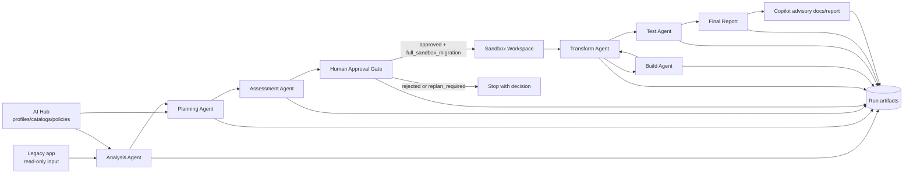

# AI Migration Factory Overview

This package documents the AI Migration Factory implemented in this repository. It is based on the current code under `migration_factory/`, `modernizer-solution-ai-hub/`, `tests/`, and the validated V1 two-stage migration evidence from June 2, 2026.

The factory is a staged, artifact-driven migration system for Java/Spring applications. It separates read-only analysis and planning from source-changing sandbox transformation, uses human approval as a required control point, and treats Copilot as advisory/reporting only.

Current validated status:

- `V1 build/test proof: DONE`
- `Runtime/H2 proof: V2`
- `Endpoint smoke: V2`
- `SQL Server: V2`
- `Production readiness: not claimed`

## Core Goals

- Analyze a legacy application without modifying source.
- Produce deterministic migration plans and approval artifacts.
- Pause for human review before any source-changing work.
- Resume approved runs into a sandbox workspace only.
- Apply transformation units and validate each source-changing unit through build checks.
- Parse post-transform test evidence.
- Generate deterministic final reports and optional Copilot advisory reports.

## Non-Goals And Safety Boundaries

- V1 does not claim runtime compatibility from compile/test success alone.
- V1 does not claim H2 startup, endpoint smoke, SQL Server readiness, security/keystore readiness, or production readiness.
- No production promotion.
- No automatic pull request creation.
- No deployment.
- No automatic merge.
- No source mutation during `read_only_assessment`.
- No legacy app mutation during sandbox transformation.
- Copilot cannot approve, transform, mutate source, change gates, override status, create PRs, or deploy.

These boundaries are enforced through code in:

- `migration_factory/agents/analysis_agent/analysis_agent/context_manager.py`
- `migration_factory/agents/analysis_agent/analysis_agent/readonly_verifier.py`
- `migration_factory/orchestrator/approval.py`
- `migration_factory/approval/artifacts.py`
- `migration_factory/transform_v1_after_approval.py`
- `migration_factory/agents/transformation_agent/workspace.py`
- `migration_factory/orchestrator/copilot_assist.py`
- `migration_factory/copilot_assist/`
- `migration_factory/final_report/context_builder.py`

## High-Level Architecture

## Primary Run Modes

`read_only_assessment`

- Runs analysis, planning, assessment, and approval interrupt.
- Does not run sandbox transformation.
- Intended for review and feasibility assessment.

`full_sandbox_migration`

- Runs the same Phase 1 stages.
- Pauses at approval.
- On approved resume, records approval artifacts, locks approved inputs, creates a sandbox, transforms the sandbox, validates build/tests, and emits final reports.

## Current V1 Migration Evidence

The final validated V1 path is two-stage:

- Source app used Spring Boot `2.1.6.RELEASE` through BOM/property metadata.
- Stage 1 profile: `springboot-2.1.6-to-2.7-java11`
- Stage 1 run id: `v1-stage1-216-to-27-watchonly-20260602-233409`
- Stage 1 result: transform `TRANSFORM_APPLIED_IN_SANDBOX`, build `BUILD_PASSED_IN_SANDBOX`, tests `PASS_WITH_WARNINGS`, Copilot `AVAILABLE`, Copilot invocation `SKIPPED`, fallback `false`.
- Stage 2 profile: `springboot-2.7-to-3.5-java17`
- Stage 2 run id: `v1-stage2-27-to-35-watchonly-20260602-233720`
- Stage 2 result: transform `TRANSFORM_APPLIED_IN_SANDBOX`, build `BUILD_PASSED_IN_SANDBOX`, tests `PASS_WITH_WARNINGS`, Copilot `AVAILABLE`, Copilot invocation `SKIPPED`, fallback `false`.
- Final sandbox `pom.xml` had Java `17` and Spring Boot `3.5.14`.
- Final manual verification in Stage 2 sandbox passed with exit code `0`: `mvn clean test -DskipITs`.

Important migration context:

- Spring Boot 3 requires Java 17 or newer.
- Spring Boot 3 uses Spring Framework 6 and Jakarta EE APIs.
- Jakarta migration means source and compatible dependencies must move away from old `javax.*` APIs where applicable.
- Compile/test success does not prove runtime compatibility.

Known final Stage 2 sandbox caveats are tracked in `docs/system/11-current-problems-and-v2-roadmap.md`.

## Documentation Index

- `docs/system/01-architecture.md` - component architecture and responsibilities.
- `docs/system/02-agent-workflow.md` - agent-by-agent technical details.
- `docs/system/03-orchestrator-flow.md` - LangGraph state flow, routing, resume, and finalization.
- `docs/system/04-profiles-ai-hub.md` - AI Hub profiles, staged Spring migration, and Java release/runtime handling.
- `docs/system/05-copilot-integration.md` - Copilot config, providers, artifacts, and safety boundaries.
- `docs/system/06-data-contracts-artifacts.md` - schemas, run directory layout, artifact refs, and report contracts.
- `docs/system/07-runtime-build-test-validation.md` - transformation, build, test, timing, and missing runtime smoke.
- `docs/system/08-known-gaps-and-risks.md` - current gaps and recommended future agents.
- `docs/system/09-how-to-run.md` - command examples and operational cautions.
- `docs/system/10-new-agent-handoff.md` - implementation handoff for a new agent.
- `docs/system/11-current-problems-and-v2-roadmap.md` - current V1 boundaries, known problems, and V2 roadmap.
