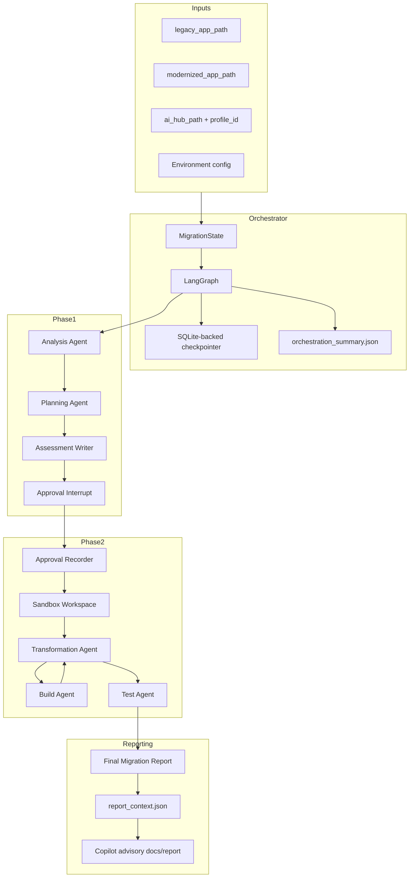

# Architecture

The repository is organized around deterministic agents and durable run artifacts. The orchestrator wires phases together with LangGraph, while each agent owns a narrow artifact contract.

## Main Components

| Area | Main paths | Responsibility |
| --- | --- | --- |
| Orchestrator | `migration_factory/orchestrator/` | State model, LangGraph routing, preflight, checkpointing, approval interrupt, resume, phase services, finalization |
| Analysis Agent | `migration_factory/agents/analysis_agent/` | Read-only source analysis, Maven/source/config/test scanning, OpenRewrite dry-run preview, read-only verification |
| Planning Agent | `migration_factory/agents/planning_agent/` | Load analysis and AI Hub profile, validate compatibility, classify risk, build migration units, write approval request |
| Assessment Agent | `migration_factory/assessment/` | Combine analysis and planning artifacts into approval readiness report |
| Approval | `migration_factory/approval/` | Validate Phase 1 artifacts, record human decision, hash-lock approved artifacts |
| Transformation | `migration_factory/transform_v1_after_approval.py`, `migration_factory/agents/transformation_agent/` | Guarded sandbox transform after approval |
| Build Agent | `migration_factory/agents/build_agent/` | Maven/Gradle detection, build/start/test command execution, failure classification, ledger update |
| Test Agent | `migration_factory/agents/test_agent/` | Parse post-transform Surefire XML reports and write test report/summary/log |
| Final report | `migration_factory/final_report/` | Deterministic final report, report context, Copilot report integration |
| Copilot assist/docs | `migration_factory/copilot_assist/`, `migration_factory/agents/copilot_doc_agent/` | Advisory sidecars and documentation-only reports |
| Contracts | `migration_factory/contracts/` | Schema constants, JSON Schema validation, ledger/build/test/report contracts |
| AI Hub | `modernizer-solution-ai-hub/` | Profiles, OpenRewrite catalogs, policies, Copilot config, report templates |
| Tests | `tests/` | Unit and integration coverage for agents, contracts, orchestrator, Copilot, reports |

## Component Diagram



## Run Directory Layout

All run outputs are expected under:

```text
<modernized_app_path>/.migration/runs/<run_id>/
```

Important subdirectories:

- `analysis/`
- `planning/`
- `assessment/`
- `approval/`
- `orchestration/`
- `transformation/`
- `workspaces/sandbox/`
- `build/`
- `test/post_transform/`
- `logs/`
- `performance/`
- `final/`
- `final/copilot_docs/`

## State Model

`migration_factory/orchestrator/state.py` defines `MigrationState`. Key state groups:

- Identity and inputs: `run_id`, `mode`, `legacy_app_path`, `modernized_app_path`, `ai_hub_path`, `profile_id`, `thread_id`.
- Phase statuses: `analysis_status`, `planning_status`, `assessment_status`, `orchestration_status`.
- Approval: `approval_status`, `approval_decision`, `approved_by`, `approval_comments`.
- Phase 2: `transform_status`, `build_status`, `test_status`, `test_totals`, `sandbox_path`, `transform_log_path`.
- Artifact tracking: `artifact_refs`, `*_artifacts_valid`.
- Final/stop fields: `final_status`, `stop_reason`, `blockers`, `warnings`, `errors`.
- Timing: `timing`.
- Copilot: `copilot_enabled`, `copilot_assist_mode`, `copilot_report_enabled`, `copilot_provider`, `copilot_model`, `copilot_timeout_seconds`, `copilot_phase_statuses`, `copilot_artifact_refs`, `copilot_warnings`, `copilot_errors`, `copilot_fallback_used`.

## Contract Philosophy

The system relies on artifacts, not implicit memory. Each phase writes files, validators check required artifacts and schemas, and later phases read from the run directory. This is visible in:

- `migration_factory/orchestrator/artifact_validation.py`
- `migration_factory/contracts/constants.py`
- `migration_factory/contracts/schema_validation.py`
- `migration_factory/assessment/writer.py`
- `migration_factory/approval/approve_run.py`
- `migration_factory/final_report/writer.py`

## Safety And Isolation

Analysis writes only to the run `analysis/` directory and verifies no source changes with file hashes.

Transformation is blocked unless:

- Phase 1 approval artifacts exist and validate.
- `approval_decision.json` decision is `approved`.
- `approved_plan_lock.json` hashes still match current plan/report artifacts.
- AI Hub profile guardrails allow sandbox transform, or `sandbox_transform_allowed: true` plus `AI_MIGRATION_ALLOW_GUARDED_SANDBOX_TRANSFORM` is enabled.

Sandbox creation copies legacy code into `workspaces/sandbox` and excludes generated/heavy directories such as `.git`, `.migration`, `target`, `build`, `node_modules`, and caches.

## Current Quality/Security Logic

Quality/security/report logic is distributed rather than a standalone agent:

- Assessment enterprise compatibility checks in `migration_factory/assessment/writer.py`.
- Build failure classification in `migration_factory/agents/build_agent/classifier.py`.
- Build environment gates for Java 21 and Boot 4 Maven minimum in `migration_factory/agents/build_agent/agent.py`.
- Report context secret/path redaction in `migration_factory/final_report/context_builder.py`.
- Copilot output and stderr redaction in `migration_factory/final_report/copilot.py`.
- Copilot documentation protected-path restoration in `migration_factory/agents/copilot_doc_agent/agent.py`.

TODO/VERIFY: There is no dedicated Quality Agent, Security Agent, runtime smoke agent, dependency compatibility scanner, or endpoint smoke checker yet.
