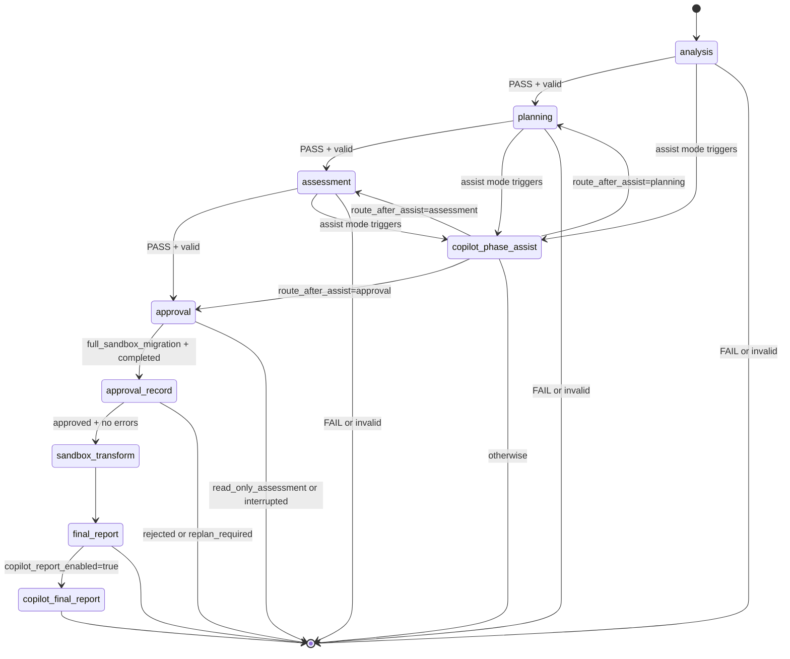
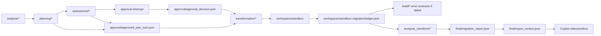

# Orchestrator Flow

The orchestrator is implemented with LangGraph in `migration_factory/orchestrator/graph.py`. The CLI entrypoints are:

- `python -m migration_factory.orchestrator.runner`
- `python -m migration_factory.orchestrator.resume`

## State Graph



## Preflight

`migration_factory/orchestrator/preflight.py` validates:

- `run_id` is present.
- `mode` is `read_only_assessment` or `full_sandbox_migration`.
- `legacy_app_path` exists.
- `modernized_app_path` can be created.
- `ai_hub_path` exists.
- `profiles/<profile_id>.yaml` exists in AI Hub.
- LangGraph `thread_id` matches `run_id`.

Failure returns exit code `2` from `runner.main`.

## Initial State

`build_initial_state()` in `migration_factory/orchestrator/state.py` creates:

- Run paths under `<modernized>/.migration/runs/<run_id>`.
- Phase statuses as `PENDING`.
- Approval status as `PENDING`.
- Empty artifact refs, blockers, warnings, errors, timing.
- Copilot defaults from `build_copilot_state_defaults()`.

Copilot env config is applied in `runner.load_copilot_config()` and `resume.load_copilot_config()`.

## Phase Node Pattern

Every deterministic phase node:

1. Calls its phase service.
2. Validates artifacts with `artifact_validation.py`.
3. Merges artifact refs, blockers, and warnings.
4. Sets `*_artifacts_valid`.
5. Sets Copilot routing helpers:
   - `copilot_assist_phase`
   - `copilot_route_after_assist`
   - `copilot_validation_had_warnings`

Route rules:

- Valid `PASS` phase routes to next phase.
- Failed or invalid phase routes to end unless Copilot assist mode asks for sidecar assistance.
- Copilot cannot repair official state.

## Modes

### read_only_assessment

Expected flow:

```text
preflight -> analysis -> planning -> assessment -> approval interrupt -> stop
```

No transform/build/test/final migration execution occurs. Assessment artifacts must keep all execution claims false.

The approval interrupt still exists because Phase 1 is intended to produce human-reviewable artifacts, but the graph does not route from approval to transform unless mode is `full_sandbox_migration`.

### full_sandbox_migration

First invocation:

```text
preflight -> analysis -> planning -> assessment -> approval interrupt
```

Resume with `approved`:

```text
approval_record -> sandbox_transform -> final_report -> optional copilot_final_report
```

Resume with `rejected` or `replan_required`:

```text
approval_record -> stop
```

## Approval Interrupt And Resume

`approval_node()` writes:

- `orchestration/approval_interrupt_state.json`

Then LangGraph `interrupt()` returns:

- `type`
- `run_id`
- summary statuses
- artifact refs
- blockers
- warnings
- decision options

`resume_orchestration()`:

1. Validates decision and `approved_by`.
2. Explicitly records approval decision through `record_approval_decision_phase()`.
3. Invokes the graph with `Command(resume=...)`.
4. Falls back to `approval_interrupt_state.json` if checkpoint resume did not complete.
5. Finalizes orchestration state.

## Guarded Transform Routing

`_route_after_approval_record()` only routes to `sandbox_transform` when:

- `mode == full_sandbox_migration`
- `approval_status == COMPLETED`
- `approval_decision == approved`
- no `errors`
- `orchestration_status != FAIL`

`run_sandbox_transform_phase()` calls `apply_approved_sandbox_transform()` and maps result fields into orchestrator state.

## Sandbox Workspace Creation

Sandbox creation is owned by `migration_factory/agents/transformation_agent/workspace.py`.

Rules:

- Sandbox lives under `run_dir/workspaces/sandbox`.
- Sandbox must not equal legacy or modernized app path.
- Existing sandbox cleanup is checked to stay inside run dir.
- Symlinks are validated.
- Excluded names include `.git`, `.migration`, `target`, `build`, `node_modules`, and caches.
- A baseline checkpoint is created through git if available, otherwise a file hash manifest.

## Build/Test Validation

Within `transform_v1_after_approval.py`:

- The Transform Agent runs a unit.
- It marks the ledger as `awaiting_build_agent`.
- The wrapper invokes `run_build_agent()`.
- Build Agent updates ledger with pass/fail and command diagnostics.
- If build passes, transform continues with the next unit.
- After final unit, Test Agent parses Surefire reports and writes post-transform test artifacts.

## Final Report Generation

`finalize_orchestration_state()` in `migration_factory/orchestrator/summary.py`:

1. Writes timing artifacts.
2. Writes orchestration summary.
3. If not a successful full sandbox migration, stops without final migration report.
4. Generates `final/migration_report.json` and `final/migration_summary.md`.
5. Writes `final/report_context.json`.
6. Optionally generates Copilot final report when `AI_MIGRATION_ENABLE_COPILOT_REPORT` is true.
7. Always attempts Copilot documentation package after successful sandbox validation.
8. Validates successful full sandbox artifact refs and statuses.

Required successful status values are enforced in `validate_successful_full_sandbox_orchestration()`:

- `approval_status = COMPLETED`
- `approval_decision = approved`
- `orchestration_status = PASS`
- `transform_status = TRANSFORM_APPLIED_IN_SANDBOX`
- `build_status = BUILD_PASSED_IN_SANDBOX`
- `test_status = TEST_PASSED`
- `final_status = TRANSFORM_APPLIED_IN_SANDBOX`

TODO/VERIFY: The transform wrapper currently treats `PASS_WITH_WARNINGS` and `TESTS_NOT_FOUND` as acceptable transform outcomes, but successful full sandbox orchestration validation requires `TEST_PASSED`.

## Checkpointing

`migration_factory/orchestrator/checkpointing.py` implements `SQLiteBackedInMemorySaver`, persisted at:

```text
<run_dir>/orchestration/langgraph_checkpoints.sqlite
```

It stores LangGraph memory saver storage, writes, and blobs as a pickled payload in SQLite. This enables resume across CLI invocations.

## Artifact Flow


