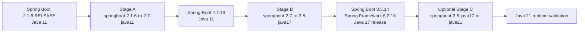

# Profiles And AI Hub

The AI Hub lives at `modernizer-solution-ai-hub/` and is the source of truth for profiles, OpenRewrite catalogs, policies, schemas, Copilot config, and report templates.

## AI Hub Layout

```text
modernizer-solution-ai-hub/
  hub.yaml
  profiles/
  catalogs/openrewrite/
  policies/
  schemas/
  agents/
  templates/reports/
```

`modernizer-solution-ai-hub/hub.yaml` defines:

- `hub_version: 1`
- `default_profile: springboot-2.7-to-3.5-java17`
- Directory names for profiles, catalogs, policies, and schemas.

## Profile Loading

Profile loading is used by:

- Analysis target stack loading: `migration_factory/agents/analysis_agent/analysis_agent/maven_scanner.py`
- Planning profile validation: `migration_factory/agents/planning_agent/profile_reader.py`
- Planning source/target compatibility: `profile_compatibility.py`
- OpenRewrite dry-run catalog selection: `rewrite_catalog_loader.py`
- Transform apply settings and guardrails: `migration_factory/transform_v1_after_approval.py`

Profile validation expects at least:

- `source`
- `target`
- `rules`
- `target.java`
- `target.spring_boot`

## Staged Spring Migration Flow



### Stage A: `springboot-2.1.6-to-2.7-java11`

Profile:

- `modernizer-solution-ai-hub/profiles/springboot-2.1.6-to-2.7-java11.yaml`

Purpose:

- Bring Spring Boot `2.1.x` applications to latest Boot `2.7.x` while staying on Java `11`.
- Avoid Jakarta namespace migration.

Important values:

- `stage: A`
- `target.java: "11"`
- `target.spring_boot: "2.7.18"`
- `target.spring_framework: "5.3.x"`
- `production_allowed: false`
- `sandbox_transform_allowed: true`
- `openrewrite.apply_allowed: true`
- `openrewrite.apply_goal: runNoFork`

Catalog:

- `modernizer-solution-ai-hub/catalogs/openrewrite/springboot-2.1.6-to-2.7-java11.yaml`
- Active recipe: `org.openrewrite.java.spring.boot2.UpgradeSpringBoot_2_7`

Real migration evidence:

- Source Boot was `2.1.6.RELEASE` through BOM/property metadata.
- Stage A worked to Boot `2.7`.

### Stage B: `springboot-2.7-to-3.5-java17`

Profile:

- `modernizer-solution-ai-hub/profiles/springboot-2.7-to-3.5-java17.yaml`

Purpose:

- Migrate Spring Boot `2.7` applications to Spring Boot `3.5.14` on Java `17`.
- Introduce Spring Framework `6.2.18` and Jakarta-era compatibility.

Important values:

- `stage: B`
- `target.java: "17"`
- `target.spring_boot: "3.5.14"`
- `target.spring_framework: "6.2.18"`
- `production_allowed: false`
- `sandbox_transform_allowed: true`
- `openrewrite.apply_allowed: true`
- `openrewrite.apply_goal: runNoFork`

Catalog:

- `modernizer-solution-ai-hub/catalogs/openrewrite/springboot-3.5-java17.yaml`
- Active recipes:
  - `org.openrewrite.java.migrate.UpgradeToJava17`
  - `org.openrewrite.java.spring.boot3.UpgradeSpringBoot_3_5`

Real migration evidence:

- Stage B worked from Boot `2.7` to Boot `3.5.14`.
- Internal dependency versions that worked:
  - `common-utils 2.9.41-SNAPSHOT`
  - `msa-dto 3.3.22-SNAPSHOT`
  - `problem-spring-web 0.29.1`

### Optional Stage C: `springboot-3.5-java17-to-java21`

Profile:

- `modernizer-solution-ai-hub/profiles/springboot-3.5-java17-to-java21.yaml`

Purpose:

- Validate the already-green Boot `3.5.x` application on a Java `21` runtime.

Important values:

- `stage: C`
- `strategy: java21_runtime_validation_only`
- `target.java: "21"`
- `target.spring_boot: "3.5.14"`
- `dry_run_only: true`
- `openrewrite.apply_allowed: false`
- `rules.dry_run_only: true`

Planning behavior:

- `migration_factory/agents/planning_agent/unit_builder.py` detects `strategy == "java21_runtime_validation_only"` and emits:
  - `baseline`
  - `java-21-runtime-validation`

Real migration evidence:

- Runtime eventually started on Java `21`.

## Java Release Vs Runtime JDK

The factory should distinguish:

- Java release target: compiler/source/bytecode intent, for example Maven compiler `release=17` or profile `target.java: "17"`.
- Runtime JDK: the actual JDK used to execute Maven, tests, Spring Boot startup, or smoke checks.

Recommended interpretation:

- Stage A release target is Java `11`. Validate with a Java 11-capable JDK.
- Stage B release target is Java `17`. Build/test should validate Java 17 bytecode compatibility. Running Maven with JDK 21 can still compile release 17 if compiler config is correct, but that does not replace Java 17 release validation.
- Stage C runtime validation is Java `21` after Stage B is already green. It should not change source release unless a separate approved profile does that.

Current code behavior:

- Build Agent can choose `JAVA_HOME` based on profile fields `source_jdk_home_env` and `target_jdk_home_env`.
- For `validation_unit_id == "baseline"`, it uses `source_jdk_home_env`.
- For other units, it uses `target_jdk_home_env`.
- Java 21 target units trigger a runtime version gate in `migration_factory/agents/build_agent/agent.py`.

TODO/VERIFY:

- Stage A/B profiles do not currently declare `source_jdk_home_env` or `target_jdk_home_env`.
- A dedicated runtime smoke agent should record release target and actual runtime JDK separately.

## Other Profiles

### `springboot-2-java8-to-boot4-java21`

Direct sandbox-only Boot 2/Java 8 to Boot 4/Java 21 profile.

Key traits:

- `strategy: direct_openrewrite_sandbox`
- `risk_level: high`
- `production_allowed: false`
- `fallback_profile: springboot-2-to-3-5-to-4-java21`
- `source_jdk_home_env: JAVA8_HOME`
- `target_jdk_home_env: JAVA21_HOME`
- `openrewrite.apply_allowed: false`

Transform guardrails block this profile unless profile settings and environment override allow guarded sandbox transformation.

### `springboot-2.1-to-3.5-java17-library-experimental`

Experimental read-only library profile.

Key traits:

- `strategy: read_only_library_assessment_first`
- `risk_level: experimental`
- `production_allowed: false`
- `openrewrite.apply_allowed: false`

### `library-jakarta-java17-minimal`

Minimal read-only library profile for Java 17 and selected `javax` to `jakarta` migrations.

Key traits:

- `strategy: read_only_library_jakarta_java17_first`
- `dry_run_only: true`
- `original_source_modification_allowed: false`
- `openrewrite.apply_allowed: false`

## Profile Guardrails

Transform guardrails are enforced in `migration_factory/transform_v1_after_approval.py`.

Blocked when any of these are true:

- `production_allowed: false`
- `dry_run_only: true`
- `rules.dry_run_only: true`
- `openrewrite.apply_allowed: false`
- `rules.openrewrite_apply_allowed: false`
- catalog `dry_run_only: true`
- catalog `rewrite_run_allowed: false`

Guarded transform override requires:

- Profile has `sandbox_transform_allowed: true`.
- Environment has `AI_MIGRATION_ALLOW_GUARDED_SANDBOX_TRANSFORM` set to true-like value.

## AI Hub Tests

- `tests/agents/planning_agent/test_staged_boot216_profiles.py`
- `tests/agents/planning_agent/test_boot4_sandbox_profile.py`
- `tests/agents/planning_agent/test_library_experimental_profile.py`
- `tests/agents/planning_agent/test_library_jakarta_java17_minimal_profile.py`
- `tests/orchestrator/test_profile_guardrails.py`
