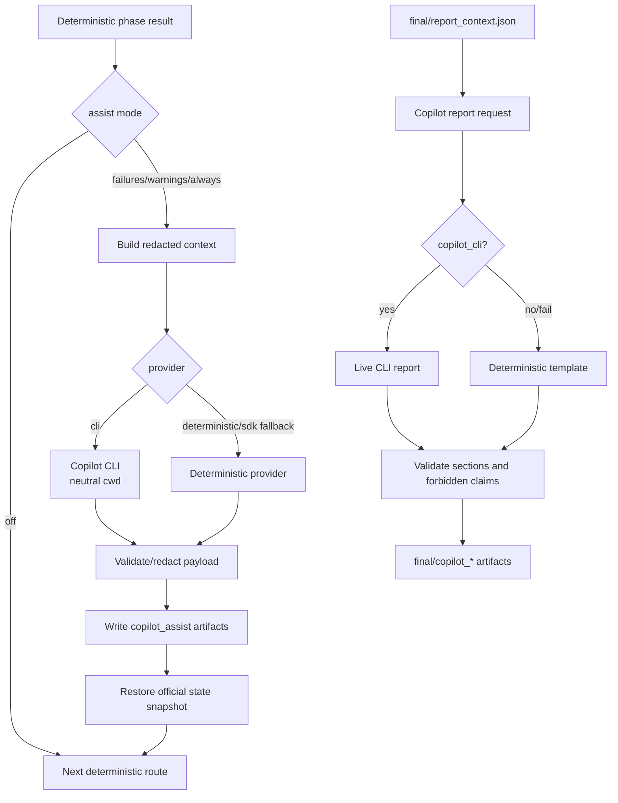

# Copilot Integration

Copilot integration is advisory. It can generate sidecar context and documentation, but official migration state and source files remain controlled by deterministic agents.

Current V1 status:

- Copilot CLI available: `GitHub Copilot CLI 1.0.58`.
- Copilot repair/fallback foundation was validated earlier.
- Copilot is optional advisory.
- If Copilot returns invalid, prose-only, or schema-invalid output, the system generates a deterministic fallback repair plan.
- In the final V1 two-stage run, Copilot was not invoked because build/test did not fail.
- Auto-apply remains disabled: `AI_MIGRATION_AUTO_APPLY_SAFE_REPAIRS=false`.

## Where Copilot Is Configured

AI Hub config:

- Planning assist: `modernizer-solution-ai-hub/agents/copilot-assist.yaml`
- Documentation agent: `modernizer-solution-ai-hub/agents/copilot-doc-agent.yaml`
- Final report manifest: `modernizer-solution-ai-hub/templates/reports/copilot_final_migration_report_v1.yaml`
- Final report template: `modernizer-solution-ai-hub/templates/reports/copilot_final_migration_report_v1.md`

Runtime/env config:

- `AI_MIGRATION_COPILOT_ASSIST`
- `AI_MIGRATION_ENABLE_COPILOT_REPORT`
- `AI_MIGRATION_COPILOT_PROVIDER`
- `AI_MIGRATION_COPILOT_MODEL`
- `AI_MIGRATION_COPILOT_TIMEOUT_SECONDS`
- `AI_MIGRATION_COPILOT_REQUIRED`
- `AI_MIGRATION_COPILOT_FAILURE_AGENT_ENABLED`
- `AI_MIGRATION_H2_STARTUP_REQUIRED`
- `AI_MIGRATION_COPILOT_REPAIR_STRICT_CONTAINMENT`
- `AI_MIGRATION_COPILOT_LOG_LEVEL`
- `AI_MIGRATION_ENABLE_COPILOT_STATEMENT`
- `AI_MIGRATION_COPILOT_DOCS_ENABLED`
- `AI_MIGRATION_COPILOT_CLI_ENABLED`
- `AI_MIGRATION_COPILOT_CLI_PATH`
- `AI_MIGRATION_COPILOT_DOCS_TIMEOUT_SECONDS`
- `AI_MIGRATION_COPILOT_DOCS_FALLBACK_ENABLED`
- Planning assist token candidates:
  - `MF_PLANNING_ASSIST_TOKEN`
  - `AIMF_COPILOT_TOKEN`
  - `GITHUB_COPILOT_TOKEN`
  - `GITHUB_TOKEN`
  - `GH_TOKEN`

Do not store actual secret values in docs or artifacts.

## Provider/Model/Config Loading

### Orchestrator phase assist

`migration_factory/orchestrator/state.py` sets defaults:

- `DEFAULT_COPILOT_ASSIST_MODE = "failures"`
- `DEFAULT_COPILOT_REPORT_ENABLED = True`
- `DEFAULT_COPILOT_PROVIDER = "copilot_cli"`
- `DEFAULT_COPILOT_MODEL = "gpt-5-mini"`
- `DEFAULT_COPILOT_TIMEOUT_SECONDS = 300`

`parse_copilot_config_from_env()` validates:

- Assist mode: `off`, `failures`, `warnings`, `always`
- Provider: `cli`, `sdk`, `deterministic`, `copilot_cli`
- Positive timeout
- Report enabled boolean
- Model string

TODO/VERIFY: `sdk` is an allowed provider value in state, but `CopilotAssistService._provider()` currently routes non-`cli` providers to deterministic fallback.

### Failure repair MVP

The first safe failure-handling MVP adds proposal-only repair infrastructure:

- `preflight/copilot_availability.json` records Copilot CLI feature probe results.
- `copilot/evidence_session_<n>/` is the only allowed Copilot repair cwd.
- `failures/failure_classification.json` is deterministic and authoritative.
- `failures/copilot_repair_request.json`, `failures/copilot_repair_response.json`, and `failures/repair_plan.md` are proposal-only artifacts.
- `transformation/openrewrite_diff_safety_report.json` records deterministic diff risk.
- `runtime/h2_startup_report.json` records optional H2-only startup evidence.

Repair Copilot must not run from repository root, sandbox root, legacy app path, or run root. It receives redacted evidence only, returns valid JSON only, and does not apply patches.

In the final V1 two-stage run this repair path stayed idle because no build/test failure required it. Copilot availability was recorded as available, invocation was `SKIPPED`, and fallback was `false`.

### Planning assist

`migration_factory/agents/planning_agent/assist_config.py` loads:

- `modernizer-solution-ai-hub/agents/copilot-assist.yaml`
- Env overrides for enablement, model, and auth mode.

Default AI Hub planning assist is disabled:

```yaml
enabled: false
provider: github_copilot
mode: assist_only
direct_write: false
```

Allowed models:

- `gpt-5-mini`
- `gpt-4.1`
- `gpt-4o`
- `gpt-4o-mini`

Auth modes:

- `github_signed_in_user`
- `oauth_github_app`
- `token`

Planning provider invocation is currently unbound in `CopilotPlanningAssistClient._perform_provider_review()`, so enabled planning assist resolves model/auth and then returns `UNAVAILABLE` unless a provider adapter is implemented.

### Final report Copilot

`migration_factory/final_report/copilot.py` loads the final report manifest from AI Hub, builds a redacted request payload, and either:

- Renders deterministic template skeleton.
- Invokes GitHub Copilot CLI if provider is `copilot_cli`.
- Falls back to deterministic template when CLI output fails.

Provider selection:

- `AI_MIGRATION_COPILOT_PROVIDER=copilot_cli` uses live CLI path.
- Any other value uses deterministic template skeleton.

## Advisory Vs Modifying Code

Copilot is advisory only.

Allowed:

- Read deterministic run artifacts.
- Write sidecar advisory JSON/Markdown under phase/final/Copilot docs directories.
- Summarize warnings and evidence.
- Produce report request/response metadata.

Forbidden:

- Approve or reject a run.
- Modify migration plans or units.
- Change blockers, warnings, errors, statuses, gates, or verdicts.
- Mutate legacy source or sandbox source.
- Create PRs.
- Deploy or promote.

`migration_factory/orchestrator/copilot_assist.py` snapshots official state fields before Copilot and restores them afterward. Only `copilot_*` fields can persist.

## Copilot Advisory Flow



Failure-repair behavior is intentionally narrower than general reporting: it is triggered by deterministic failure evidence, validates Copilot output against schema, and falls back deterministically when the live advisory output is unusable.

## Copilot Artifacts

Phase assist:

- `<run_dir>/<phase>/copilot_assist.json`
- `<run_dir>/<phase>/copilot_assist.md`
- Refs recorded in `copilot_artifact_refs`

Planning audit:

- `planning/copilot_assist.json`

Final report:

- `final/copilot_report_request.json`
- `final/copilot_report_response.json`
- `final/copilot_migration_report.md`

Advisory statement:

- `final/copilot_migration_statement.json`
- `final/copilot_migration_statement.md`

Documentation package:

- `final/copilot_docs/migration_overview.md`
- `final/copilot_docs/technical_changes.md`
- `final/copilot_docs/validation_evidence.md`
- `final/copilot_docs/risks_and_warnings.md`
- `final/copilot_docs/copilot_review.md`
- Optional CLI metadata:
  - `final/copilot_docs/input_manifest.json`
  - `final/copilot_docs/copilot_cli_status.json`

## Copilot Phases

Current supported phase sidecars:

- `analysis`
- `planning`
- `assessment`
- `transformation`
- `build`
- `quality`
- `security`
- `final`

Actual graph routing uses sidecars after analysis, planning, and assessment validation, and optional final report after deterministic final context exists.

Documentation package runs after successful sandbox validation in `finalize_orchestration_state()`.

## Safety Boundaries In Code

- Official state restoration: `migration_factory/orchestrator/copilot_assist.py`
- Redaction of paths/secrets: `migration_factory/final_report/context_builder.py`
- Copilot CLI contained flags and neutral cwd: `migration_factory/copilot_assist/providers/cli_provider.py`
- Final report validation against missing sections and forbidden Copilot execution claims: `migration_factory/final_report/copilot.py`
- Documentation CLI protected-path snapshot/restore: `migration_factory/agents/copilot_doc_agent/agent.py`

## Adding A New Copilot Provider

Recommended steps:

1. Add provider implementation under `migration_factory/copilot_assist/providers/`.
2. Return `ProviderResult` from `phase_assist` and `final_report` compatible methods.
3. Add provider selection in `CopilotAssistService._provider()`.
4. Add provider name to `COPILOT_PROVIDER_VALUES` in `migration_factory/orchestrator/state.py`.
5. Add env parsing tests for the new provider.
6. Add state-safety tests proving the provider cannot mutate official state.
7. Add artifact schema validation tests.
8. Ensure all logs redact secrets and do not persist full executable paths or tokens.

For final report providers, also update `migration_factory/final_report/copilot.py` provider selection and validation/fallback behavior.

## Secrets And Env Vars

Required only when using live providers:

- GitHub CLI auth context for `github_signed_in_user`.
- Token env vars for token/OAuth modes.
- Copilot CLI installed and discoverable for `copilot_cli`.

Never print or persist actual values. Current code redacts:

- GitHub tokens such as `ghp_*`, `gho_*`, `github_pat_*`.
- Bearer tokens.
- Authorization headers.
- Env values with names containing token/secret/password/credential/API key.
- Private keys.
- User home paths in report contexts.

## Tests Covering Copilot

- `tests/orchestrator/test_copilot_assist_routing.py`
- `tests/orchestrator/test_copilot_state_safety.py`
- `tests/orchestrator/test_copilot_assist_routing.py`
- `tests/agents/planning_agent/test_copilot_auth.py`
- `tests/agents/planning_agent/test_copilot_model.py`
- `tests/agents/planning_agent/test_copilot_guardrails.py`
- `tests/agents/planning_agent/test_copilot_custom_agent.py`
- `tests/agents/planning_agent/test_copilot_assist_client.py`
- `tests/reporting/test_copilot_final_report.py`
- `tests/test_final_report.py`
- `tests/tui/test_copilot_status.py`
