# Data Contracts And Artifacts

The factory is contract-first. Each phase writes artifacts under the run directory, and downstream phases read and validate those artifacts.

## Run Artifact Flow

```mermaid
flowchart LR
    subgraph Analysis
        AR[analysis_report.json]
        DG[dependency_graph.json]
        TI[test_inventory.json]
        AS[analysis_summary.md]
        ROV[read_only_verification.json]
        ORP[rewrite_plugin_plan.json]
        ORI[rewrite_impact_summary.json]
    end

    subgraph Planning
        MP[migration_plan.yaml]
        MU[migration_units.yaml]
        PS[plan_summary.md]
        AP[approval_request.json]
        PV[plan_validation_report.json]
        PCA[copilot_assist.json]
    end

    subgraph Assessment
        REP[assessment_report.json]
        SUM[assessment_summary.md]
    end

    subgraph Approval
        DEC[approval_decision.json]
        LOCK[approved_plan_lock.json]
    end

    subgraph TransformValidate
        TEP[transformation_execution_plan.yaml]
        PLUG[openrewrite-plugin.xml]
        LEDGER[workspaces/sandbox/.migration/ledger.json]
        BLOG[build error contracts]
        TEST[test/post_transform/test_report.json]
    end

    subgraph Final
        OS[orchestration_summary.json]
        FR[migration_report.json]
        FS[migration_summary.md]
        CTX[report_context.json]
        TIME[timing_report.json]
    end

    Analysis --> Planning --> Assessment --> Approval --> TransformValidate --> Final
```

## Contract Constants

`migration_factory/contracts/constants.py` defines common artifact names and values:

- `SCHEMA_VERSION = "1.0.0"`
- Required analysis artifacts:
  - `analysis_report.json`
  - `dependency_graph.json`
  - `test_inventory.json`
  - `analysis_summary.md`
- Optional analysis artifacts:
  - `config_inventory.json`
  - `rewrite_plugin_plan.json`
  - `rewrite_preview.json`
  - `rewrite_dry_run.patch`
  - `rewrite_impact_summary.json`
  - `read_only_verification.json`
- Required planning artifacts:
  - `migration_plan.yaml`
  - `migration_units.yaml`
  - `plan_summary.md`
  - `approval_request.json`
  - `plan_validation_report.json`
- Optional planning artifacts:
  - `copilot_assist.json`
- Required assessment artifacts:
  - `assessment_report.json`
  - `assessment_summary.md`
- Status values:
  - `PASS`, `FAIL`, `WARNING`, `SKIPPED`
- Risk values:
  - `LOW`, `MEDIUM`, `HIGH`, `BLOCKED`, `UNKNOWN`
- Approval decisions:
  - `approved`, `rejected`, `replan_required`

Note: `orchestrator/artifact_validation.py` treats `read_only_verification.json` as required for analysis validation, even though the shared constants list it as optional.

## Schema Validation

Schema validation is implemented in:

- `migration_factory/contracts/schema_validation.py`
- JSON Schemas under `migration_factory/contracts/schemas/`

Important schema-backed artifacts:

- `analysis_report.json`
- `read_only_verification.json`
- `rewrite_plugin_plan.json`
- `rewrite_impact_summary.json`
- `migration_plan.yaml`
- `migration_units.yaml`
- `approval_request.json`
- `assessment_report.json`
- `approval_decision.json`
- `approved_plan_lock.json`
- `test_report.json`
- Copilot request/response/context artifacts

Validation uses `jsonschema.Draft7Validator`.

## Analysis Contracts

Required by orchestrator:

- `analysis_report.json`
- `dependency_graph.json`
- `test_inventory.json`
- `analysis_summary.md`
- `read_only_verification.json`

Key read-only contract:

- `read_only_verification.json.source_modified` must be `false`.

OpenRewrite preview contracts:

- `rewrite_plugin_plan.json` captures plugin, recipe artifacts, active recipes, catalog status, and preview/apply safety.
- `rewrite_impact_summary.json` captures impact, changed files, high-risk files, migration signals, blocked reasons, warnings, source modification flag.

## Planning Contracts

Required by orchestrator:

- `migration_plan.yaml`
- `migration_units.yaml`
- `plan_summary.md`
- `approval_request.json`
- `plan_validation_report.json`

`migration_plan.yaml` includes:

- schema/run/status/risk/profile
- source stack and target stack
- executable flag
- human approval requirement
- risks, blockers, warnings
- profile governance when present
- unit references
- artifact refs

`migration_units.yaml` includes ordered units with:

- `id`
- `goal`
- `tools`
- `validation`
- `writes_source`
- `required`
- `expected_artifacts`
- `rollback_strategy`
- `blocking_gate`
- `assist_policy`

Allowed current unit orders are enforced in `planning_agent/output_validator.py`:

- Baseline Java 17 / Boot 3.5 path.
- Boot 4 sandbox path.
- Stage A Boot 2.7 path.

`approval_request.json` includes:

- `requires_human_approval: true`
- decision options in exact order
- recommended decision must be null
- units to execute
- blockers and warnings

## Assessment Contracts

`assessment_report.json` includes:

- status
- profile
- overall risk
- source/target stack
- analysis summary
- planning summary
- OpenRewrite dry-run section
- enterprise compatibility section
- migration units
- blockers/warnings
- Copilot advisory status
- approval readiness
- read-only verification
- next recommended phase
- execution claims
- artifact refs

Critical approval readiness rule:

- `approval_readiness.status` must be `READY_FOR_REVIEW`.

Critical non-execution rule:

- These execution claims must remain false in assessment:
  - `transformation_executed`
  - `openrewrite_apply_executed`
  - `migrated_build_executed`
  - `migrated_tests_executed`
  - `final_migration_executed`

## Approval Contracts

`approval_decision.json`:

- decision
- decided_by
- decided_at
- comments
- plan lock ref when approved
- source
- artifact refs

`approved_plan_lock.json`:

- hashes with `sha256`
- locks required artifacts:
  - `planning/migration_plan.yaml`
  - `planning/migration_units.yaml`
  - `assessment/assessment_report.json`
- locks optional artifact if present:
  - `analysis/rewrite_plugin_plan.json`

The transform path validates the decision and verifies current hashes still match the lock.

## Migration Ledger Contract

`migration_factory/contracts/migration/ledger.py` owns the sandbox ledger.

Statuses:

- `initialized`
- `unit_in_progress`
- `awaiting_build_agent`
- `build_validated`
- `blocked`
- `completed`

Build validation statuses:

- `not_required`
- `pending`
- `passed`
- `failed`

The ledger records:

- current unit
- next unit index
- completed units
- blocked unit
- build validation command/result
- per-unit transformations
- command tails and durations
- test validation summary

## Build Error Contract

`migration_factory/contracts/build/schemas.py` defines `BuildErrorContract` and `BuildRunResult`.

Build errors include:

- project path
- cwd
- build tool
- command
- requested/resolved command
- status/result kind/message
- matched log line
- exit code
- module/main class
- stdout/stderr tails
- unit id
- Java home env/name
- detected/required versions
- Maven/JAVA/PATH diagnostics

Sensitive environment values are not intentionally recorded, but paths and command diagnostics can still reveal local tool locations. Final report context redacts user home paths.

## Test Report Contract

`migration_factory/agents/test_agent/agent.py` writes `test/post_transform/test_report.json`.

Fields include:

- `test_status`
- `build_status`
- `build_exit_code`
- totals
- command/cwd
- sandbox path
- execution owner/mode
- report paths
- warnings
- Surefire report metadata
- detected test sources
- reason
- source log path
- parse duration

Current status values:

- `TEST_PASSED`
- `TEST_FAILED`
- `TEST_ERROR`
- `PASS_WITH_WARNINGS`
- `TESTS_NOT_FOUND`

## Final Report Contracts

`final/migration_report.json` is generated only after successful full sandbox migration criteria are satisfied.

It includes:

- run id
- source/target stack
- risk level/strategy/fallback profile
- approval and lock status
- transform/build/test status
- test totals
- executed recipes
- warnings and limitations
- sandbox path
- log paths
- artifact refs

`final/report_context.json` is a redacted, provenance-rich source for Copilot/reporting.

## Copilot Contracts

Important schemas:

- `copilot_assist.schema.json`
- `copilot_report_request.schema.json`
- `copilot_report_response.schema.json`
- `copilot_report_context.schema.json`

Guardrail fields consistently include false values for capabilities such as:

- approve
- transform
- mutate source
- mutate plan
- change gates
- override status
- create PR
- deploy

## Tests Covering Contracts

- `tests/contracts/test_contract_constants.py`
- `tests/contracts/test_schema_validation.py`
- `tests/orchestrator/test_artifact_validation.py`
- `tests/assessment/test_assessment_writer.py`
- `tests/reporting/test_report_context.py`
- `tests/reporting/test_copilot_final_report.py`
- `tests/test_build_agent.py`
- `tests/test_test_agent.py`
- `tests/test_final_report.py`
